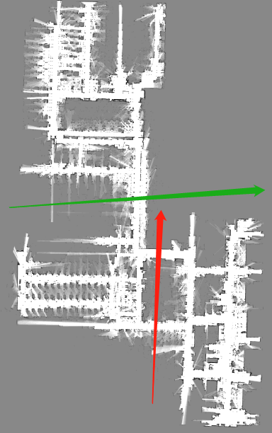
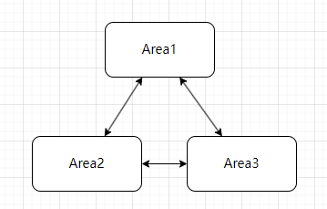
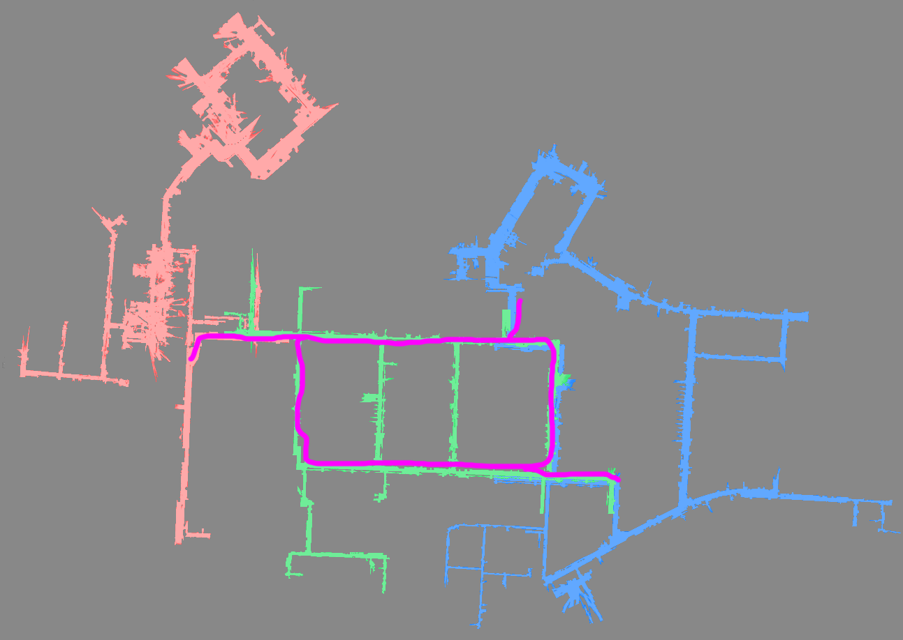

Piece by Piece Mapping
======================

For a very large map which exceeds the capability of a single map, we can create several connected maps instead. When the robot moves in the overlapped area between two maps, it can switch to another map and continue moving.

## 简单法

### 简单分区建图步骤

1. 先建 Area 1。
2. 使用 Area 1 定位，并走到 Area1 和 Area2 的重叠处。
3. 开启新建图，注意设置 `{ "start_pose_type": "current_pose" }`，这样，就会沿用当前坐标，作为新地图的起点坐标。这样，两张图的坐标系就是彼此连续的。
4. Area 2建图完毕。
5. 以此类推，继续建 Area 3

可以适当增加两个地图的重叠部分（建Area2 时，向回走一段儿）。重叠大点儿，有更大的面积可以切换地图。

### 简单法适用场景

有些地图，有明显的单通道切点可以切开成多个部分。就可以采用这个方法。
如果切开后，两部分之间会有多条通道相连。此时就不适合使用这个简单方法。

如下图。绿色线适合切开，红色线就不适合。

另外，分开的多区域，用不能有大的环状结构。如图：

| Suitable          | Not Suitable          |
| ----------------- | --------------------- |
|  |  |

## 主干法

### 主干法分区建图步骤

1. 先做分析和规划，找到骨干和枝叶。
2. 先沿着骨干走，把骨干建出来（主干要包含主要的大回环，并且能通向所有的枝叶）。起名 backbone 。
3. 加载 backbone，走到第一个区域 Area 1 附近，开启增量建图。
4. 结束建图。注意，要选择 `{"new_map_only": true}`。也就是只保存增量的部分，不保存 backbone 中的部分。
5. 以此类推，把每个区域都建好。

最终，主干地图是扔掉不用的。它只是为了让各个部分都和它匹配、回环。

如下图，紫的线，就是主干。可以先沿着紫色线建图。然后再分别建绿色、红色、蓝色。

