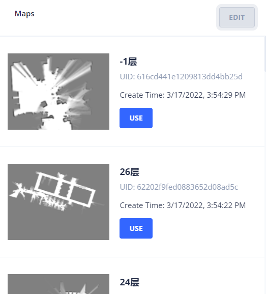
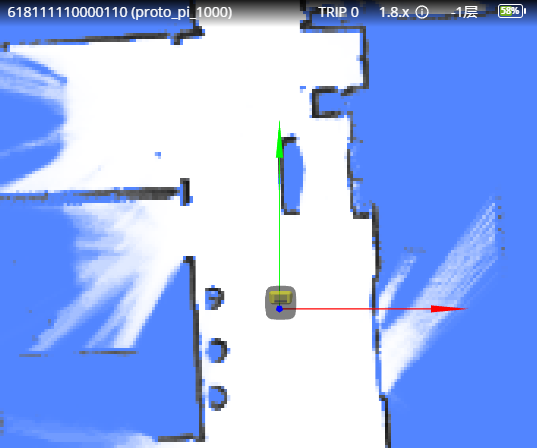

# 开始运动

要让机器人动起来，首先要做两件事：

1. 为它设置地图。
2. 为它设置初始位姿。

## 设置地图

可以先通过云平台浏览地图，找到机器人当前所在的地图。



也可以通过 [列举地图 API](../reference/maps.md#列举地图)，找到需要的地图。

用 `POST /chassis/current_map` 可以把某张地图设置为当前地图。

```bash
curl -X POST http://localhost:8000/chassis/current_map \
  -H "Content-Type: application/json" \
  -d '{"map_id": 286}'
```

```json
{
  "id": 286,
  "uid": "616cd441e1209813dd4bb25d",
  "map_name": "-1层",
  "create_time": 1647503669,
  "map_version": 6,
  "overlays_version": 8
}
```

## 设置位姿

要让机器人运动起来，首先要设置初始位姿。

建图时，一般会从充电桩上开始建图，所以，机器人在充电桩上的位姿，就是地图的原点。

```bash
curl -X POST http://localhost:8000/chassis/pose \
  -H "Content-Type: application/json" \
  -d '{"position": [0, 0, 0], "ori": 1.57}'
```

- `position: [0, 0, 0]` 表示当前坐标为 `x=0, y=0, z=0`。
- `ori: 1.57` 表示车头向上(Y 轴正方向)。

地图、位姿都设置完成后，从监控平台查看，应该为：



## 发起运动

此时，就可以控制机器人运动了。使用 `POST /chassis/moves`，创建一个新的运动任务。

```bash
curl -X POST http://localhost:8000/chassis/moves \
  -H "Content-Type: application/json" \
  -d '{"type":"standard","target_x":0.731,"target_y":-1.525,"target_z":0},"creator":"head-unit"'
```

```json
{
  "id": 4409,
  "creator": "head-unit",
  "state": "moving",
  "type": "standard",
  "target_x": 0.731,
  "target_y": -1.525,
  "target_z": 0.0,
  "target_ori": null,
  "target_accuracy": null,
  "use_target_zone": null,
  "is_charging": null,
  "charge_retry_count": 0,
  "fail_reason": 0,
  "fail_reason_str": "None - None",
  "fail_message": "",
  "create_time": 1647509573,
  "last_modified_time": 1647509573
}
```

## 查询运动任务的状态

使用 `GET /chassis/moves/:id` 可以查看某个运动任务的状态。

```bash
curl http://localhost:8000/chassis/moves/4409
```

```json
{
  "id": 4409,
  "creator": "head-unit",
  "state": "finished",
  "type": "standard",
  "target_x": 0.7310126134385344,
  "target_y": -1.5250144001960249,
  "target_z": 0.0,
  "target_ori": null,
  "target_accuracy": null,
  "use_target_zone": null,
  "is_charging": null,
  "charge_retry_count": 0,
  "fail_reason": 0,
  "fail_reason_str": "None - None",
  "fail_message": "",
  "create_time": 1647509573,
  "last_modified_time": 1647509573
}
```

`state` 字段，表示任务的当前状态。

运动状态是不断变化的，使用 `GET /chassis/moves/:id` 虽然可以查询状态，但是它效率较低。
此时，使用 websocket，让机器人主动汇报状态，就会更加高效。
