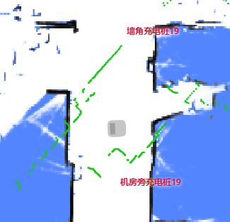
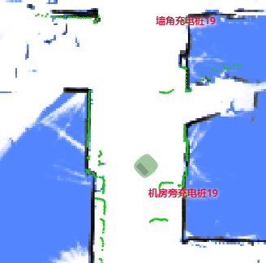

# Current Map and Pose API

## Set Current Map

There are two ways to set current map:

- Set current map with `map_id` or `map_uid`.
- Set current map with data directly. (Since 2.7.0)

```bash
curl -X POST \
  -H "Content-Type: application/json" \
  -d '{"map_id": 286}' \
  http://192.168.25.25:8090/chassis/current-map
```

**Request Params**

```ts
class SetCurrentMapRequest {
  map_id?: number; // Either 'map_id' or 'map_uid' must be provided.

  // Since 2.5.2. Map can be set with "uid".
  // Before that, only 'map_id' is supported.
  map_uid?: string;
}
```

Since 2.7.0, we can use the following `POST` request to set current map.

```ts
class SetCurrentMapWithDataRequest {
  map_name: string;
  occupancy_grid: string; // base64 encoded PNG
  carto_map: string; // binary map data
  grid_resolution: number; // 0.05
  grid_origin_x: number; // the X coordinate of lower left corner of PNG map
  grid_origin_y: number; // the Y coordinate of lower left corner of PNG map
  overlays: string; // See documents about overlays
}
```

## Get Current Map

```bash
curl http://192.168.25.25:8090/chassis/current-map
```

```json
{
  "id": 287,
  "uid": "62202f9fed0883652d08ad5c",
  "map_name": "26层",
  "create_time": 1647862075,
  "map_version": 15,
  "overlays_version": 25
}
```

`id` represents a map of [Map List](./maps.md#map-list).
When current map is set with data directly, `id` will be -1.

Latched topic `/map/info` contains the information of currently used map.
When current map changes, a new message will be received.

```bash
$ wscat -c ws://192.168.25.25:8090/ws/v2/topics
> {"enable_topic": "/map/info"}
< {
  "topic": "/map/info",
  "name": "26层",
  "uid": "62202f9fed0883652d08ad5c",
  "map_version": 15,
  "overlays_version": 25,
  "overlays": {...}
}
```

## Set Pose

Set the pose (position/orientation) of the robot on current map.

```bash
curl -X POST \
  -H "Content-Type: application/json" \
  -d '{"position": [0, 0, 0], "ori": 1.57}' \
  http://192.168.25.25:8090/chassis/pose
```

**Request Params**

```ts
class SetPoseRequest {
  position: [number, number, number]; // coordinates x, y, z. z is always 0。
  ori: number; // heading of the robot, in radian, counter-clockwise. 0 means x-positive.

  // [Optional]
  // If True, we will try to correct initial position error within a small area.
  // If False, we will not attempt to do it.
  // If not provided, the behavior is undefined. It may differ
  // with software version, environment and some global settings.
  adjust_position?: boolean;
}
```

If `adjust_position = true`, we will detect and correct initial position error, based on lidar observation.
For example, if the heading of the robot is wrongly assigned, we will make best effort to correct it.

| Before Correction            | After Correction            |
| ---------------------------- | --------------------------- |
|  |  |

:::warning
Inevitably, the correction algorithm may be misguided by changed environment.
So if you can be sure the initial pose is correct, specially when there are some misguiding patterns, make sure `adjust_position=false`
:::

## Pose Feedback

Latched topic `/tracked_pose` contains the latest robot pose.

```bash
$ wscat -c ws://192.168.25.25:8090/ws/v2/topics
> {"enable_topic": "/tracked_pose"}
< {"topic": "/tracked_pose", "pos": [-3.553, -0.288], "ori": -1.28}
< {"topic": "/tracked_pose", "pos": [-3.55, -0.285], "ori": -1.28}
```
