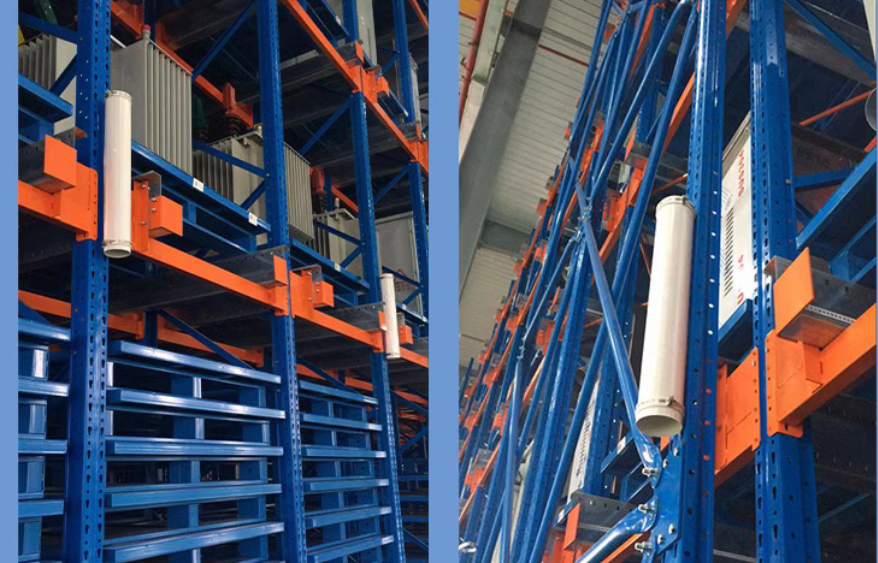

# Landmarks

Since 2.11.0

In a typical stock area where cargos are lying randomly everywhere,
the only thing that doesn't change are the legs of stock shelves.
In this case, lidar landmarks can be used to consolidate positioning.

Landmarks are made of reflective cohesive material, sticked to legs of shelves.
There are some pre-made reflective cylinders sold on some online stores.

The process to use landmarks are as follow:

## Deploy landmarks

- Stick landmark on positions that will never change, like the corners of walls, legs of selves, etc.
- Adjacent landmarks should be at least 1 meters apart. The suggested density is 10 to 50 meters. 

## Collecting Landmarks

There are two ways to collect landmarks:

* Start a new mapping task.
  1. Start mapping process as usual.
      - Optional: Collected landmarks can be realtime previewed in [`/landmarks`](../reference/websocket.md#landmarks) websocket channel.
  2. Finish mapping
      - The final result of landmarks can be accessed from [mapping result as `landmark_url`](../reference/mappings.md#mapping-detail).
* Collect landmarks for a existing map.
   1. Use service [Collect Landmarks](./services.md#collect-landmarks)

The collected landmarks are not used directly, but serves as raw materials to be imported into overlays.
Save landmarks into overlays. See [landmarks in overlays](../reference/overlays.md#landmarks)

## Start positioning with the map

Landmarks in the overlays will be used to enhance positioning automatically.

Optional: The in-use landmarks can be observed from `/constraint_list` websocket channel.
