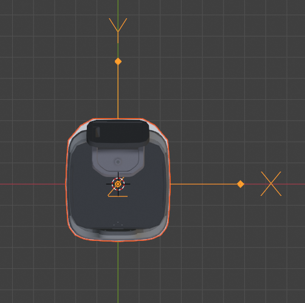

# Robot Params API

## Get Params

```bash
curl http://localhost:8000/robot-params
```

```json
{
  "/wheel_control/max_forward_velocity": 0.8,
  "/wheel_control/max_backward_velocity": -0.2,
  "/wheel_control/max_forward_acc": 0.26,
  "/wheel_control/max_forward_decel": -2.0,
  "/wheel_control/max_angular_velocity": 0.78,
  "/wheel_control/acc_smoother/smooth_level": "normal", // since 2.7.0. "disabled/lower/normal/higher"
  "/planning/auto_hold": true, // since 2.3.0
  "/control/bump_tolerance": 0.5, // since 2.4.0
  "/robot/footprint": [[0.248, 0.108], [0.24, 0.174], "..." , [0.248, -0.108]] // since 2.5.0
}
```

`/planning/auto_hold` controls whether the wheels are locked or free when the robot is idle.
With `auto_hold` turns off, when the robot is not on-duty, the user can freely push/drag it.
This can be convenient when users want to freely adjust the robot's heading and make it more comfortable
to place goods on it.
But when the robot stands on a steep slope, it will always be locked even when `auto_hold` is off.

`/control/bump_tolerance` is the degree of tolerance of bumpiness.
Value range is 0-1 with 0.5 as a neutral value.
The robot can slow down when bumpiness increase to intolerable level.
It also learns and remember doorsills in a map and slow down in advance.
With a larger value, the robot is less affected by bumpiness.
With a smaller value, the robot moves even slower(before doorsills and bumpy road).

`/robot/footprint` should reflect the top view of the robot. 
It's used for collision detection and must be configured correctly.
The data of the footprint is defined as follow:

1. The origin of the footprint should be the rotation center of the robot.
2. The x axis points to the right of the robot. The y axis points to the front of the robot
3. The polygon **MUST BE A CONVEX**.
4. The polygon should not be closed (the first point should not be the same as the last one).



## Set Params

Multiple params can be updated at once.

```bash
curl -X POST \
  -H "Content-Type: application/json" \
  -d '{"/wheel_control/max_forward_velocity": 1.2, "/control/bump_tolerance": 0.5}' \
  http://localhost:8000/robot-params
```


