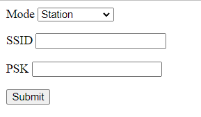

# Service API

## Recalibrate IMU

Calibrate IMU. The robot must be set still on hard and flat surface.

```bash
curl -X POST \
  -H "Content-Type: application/json" \
  -d '{"calibrate_pose": false}' \
  http://localhost:8000/services/imu/recalibrate
```

**Parameters**

```ts
interface CalibrateImuRequest {
  calibrate_pose?: boolean; // Experimental Feature. default to false.
}
```

This service call only initiates the calibration. The actual process usually takes 10 seconds.

So one should use Websocket `/imu_state` to monitor the progress and result. When calibration finished, stop listen to `/imu_state`.

```bash
$ wscat -c ws://localhost:8000/ws/v2/topics
connected (press CTRL+C to quit)
> {"enable_topic": "/imu_state"}
< {"topic": "/imu_state", "calibrate_state": 1, "calibrate_fail_reason": 0, ...}
< {"topic": "/imu_state", "calibrate_state": 1, "calibrate_fail_reason": 0, ...}
< {"topic": "/imu_state", "calibrate_state": 1, "calibrate_fail_reason": 0, ...}
< {"topic": "/imu_state", "calibrate_state": 2, "calibrate_fail_reason": 0, ...}
> {"disable_topic": "/imu_state"}
```

**Fields**

| Field                 | Description                                    |
| --------------------- | ---------------------------------------------- |
| calibrate_state       | 1 calibrating 2 succ 3 failed                  |
| calibrate_fail_reason | 0 none 1 there is vibration during calibration |

## Set Control Mode

```bash
curl -X POST \
  -H "Content-Type: application/json" \
  -d '{"control_mode": "auto"}' \
  http://localhost:8000/services/wheel_control/set_control_mode
```

**Parameters**

```ts
class SetControlModeRequest {
  control_mode: 'auto' | 'manual' | 'remote';
}
```

Use `/wheel_state` websocket topic，to monitor wheel state.

```bash
$ wscat -c ws://localhost:8000/ws/v2/topics
> {"enable_topic": "/wheel_state"}
< {"topic": "/wheel_state", "control_mode": "auto", "emergency_stop_pressed": true }
```

## Set/Clear Emergency Stop

```bash
curl -X POST \
  -H "Content-Type: application/json"
  -d '{"enable": true}'
  http://localhost:8000/services/wheel_control/set_emergency_stop
```

**Parameters**

```ts
class SetEmergencyStopRequest {
  enable: boolean;
}
```

Use `/wheel_state` topic, to monitor emergency stop state.

```bash
$ wscat -c ws://localhost:8000/ws/v2/topics
> {"enable_topic": "/wheel_state"}
< {"topic": "/wheel_state", "control_mode": "auto", "emergency_stop_pressed": true }
```

## Restart Service

Restart all services.

```bash
curl -X POST \
  -H "Content-Type: application/json"
  -d '{"enabled": true}'
  http://localhost:8000/services/restart_service
```

## Shutdown/Reboot Device

```bash
curl -X POST \
  -H "Content-Type: application/json"
  -d '{"target": "main_power_supply", reboot: false}'
  http://localhost:8000/services/baseboard/shutdown
```

**Parameters**

```ts
class ShutdownRequest {
  target:
    | 'main_computing_unit' // only reboot/shutdown the main computing board
    | 'main_power_supply'; // reboot/shutdown the whole device
  reboot: boolean; // true = reboot， false = shutdown
}
```

## Clear Wheel Errors

```bash
curl -X POST http://localhost:8000/services/wheel_control/clear_errors
```

## Clear Flip Error

Error 8004(flip error) usually means serious trouble - the robot might have fallen over.
It requires human checking. If the problem is solved, use this service to clear the error to make the robot operational again.

```bash
curl -X POST http://localhost:8000/services/monitor/clear_flip_error
```

## Clear Slide Error

:::warning
Experimental Feature
:::

Error 2008(slide error) means the the robot may have serious impact with some invisible obstacle. It demands human checking before clearing the error.

```bash
curl -X POST http://localhost:8000/services/monitor/clear_slipping_error
```

## Power On/Off Lidar

```bash
curl -X POST \
  -H "Content-Type: application/json"
  -d '{"action": "power_on"}'
  http://localhost:8000/services/baseboard/power_on_lidar
```

**Parameters**

```ts
class PowerOnRequest {
  action: 'power_on' | 'power_off';
}
```

## Power On/Off Depth Camera

```bash
curl -X POST \
  -H "Content-Type: application/json"
  -d '{"enabled": true}'
  http://localhost:8000/services/depth_camera/enable_cameras
```

**Parameters**

```ts
class EnableDepthCameraRequest {
  enable: boolean;
}
```

## Setup Wifi

Switch WIFI to Access-Point or Station mode.

```bash
curl -X POST \
  -H "Content-Type: application/json"
  -d '{"mode": "station", "ssid":"xxxxxxxxx", "psk": "xxxxx"}'
  http://localhost:8000/services/setup_wifi
```

**Parameters**

```ts
class SetupWifiRequest {
  mode: 'ap' | 'station';
  ssid?: string; // SSID, required for station mode
  psk?: string; // Wi-Fi Protected Access Pre-Shared Key, required for station mode
}
```

A static HTML page is also provided and can be accessed from local network. http://localhost:8000/wifi_setup



## Wake Up Device

Awake the robot from sleeping state. If robot is already in awake state, it does nothing.

```bash
curl -X POST http://localhost:8000/services/wake_up_device
```

Monitor websocket [Sensor Manager State](./websocket.md#sensor-manager-state) for sleep/awake/awakening state.

## Start Global Positioning

```bash
curl -X POST \
  -H "Content-Type: application/json"
  http://localhost:8000/services/start_global_positioning
```

The feedback can be received from [Global Positioning State](./websocket.md#global-positioning-state).
