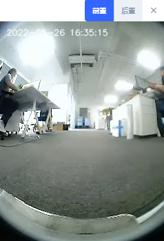
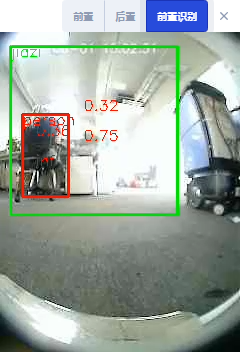

# Websocket 频道参考

## 轮控状态

```json
{
  "topic": "/wheel_state",
  "control_mode": "auto", // auto/remote/manual，对应自动、手推、远控
  "emergency_stop_pressed": true // 急停是否按下
}
```

## 视觉检测的物体

::: warning
还在开发中。
:::

```ts
enum VisualObjectLabel {
  none = 0,
  person = 1,
  platformHandTruck = 2,
  scaffold = 3,
  queueStand = 4,
  portableGrandstand = 5,
}
```

```json
{
  "topic": "/vision_detected_objects",
  "boxes": [
    {
      "pose": { "pos": [0.32, 0.97], "ori": 0.0 }, // 物体的位置和朝向
      "dimensions": [0.0, 0.0, 0.0], // 物体的宽、长、高
      "value": 0.8005573153495789,
      "label": 1 // VisualObjectLabel
    },
    {
      "pose": { "pos": [0.63, 1.08], "ori": 0.0 },
      "dimensions": [0.0, 0.0, 0.0],
      "value": 0.5348057150840759,
      "label": 1
    },
    {
      "pose": { "pos": [0.51, 0.74], "ori": 0.0 },
      "dimensions": [0.0, 0.0, 0.0],
      "value": 0.41888049244880676,
      "label": 1
    }
  ]
}
```

## 电池信息

```json
{
  "topic": "/battery_state",
  "secs": 1653299708, // 时间戳
  "voltage": 26.3, // 电池电压
  "current": 3.6, // 电池电流。充电时，一般为负。运行时，一般为正。
  "percentage": 0.64, // 电量
  "power_supply_status": "discharging" // charging/discharing/full
}
```

## 定位位姿

自车在当前地图下的位姿。

```json
{
  "topic": "/tracked_pose",
  "pos": [3.7325, -10.8525],
  "ori": -1.56 // 朝向。X轴正向为0。Y 轴正向为 pi/2
}
```

## MoveAction 执行状态

用于实时返回当前 MoveAction 的执行状态。

```ts
enum ActionType
{
  none,
  standard, // 一般运动
  charge // 充电
  along_given_route, // 沿固定轨迹行驶
  return_to_elevator_waiting_point, // 返回电梯待命点(当进电梯失败时用)
  pull_over // 靠边停车
}

enum MoveState
{
  none,
  idle,
  moving,
  succeeded,
  failed,
  cancelled
}
```

```json
{
  "topic": "/planning_state",
  "action_id": 561,
  "action_type": "standard", // see ActionType
  "move_state": "moving", // see MoveState
  "target_poses": [
    {
      "pos": [4.08, 2.99],
      "ori": 0
    }
  ],
  "fail_reason": 0, // 当 move_state 为 failed 时，显示错误原因
  "fail_reason_str": "none", // 当 move_state 为 failed 时，显示错误原因
  "remaining_distance": 2.8750057220458984, // 剩余距离

  // 目标点的位姿
  // 当前运动目标。不一定是传入的目标坐标(当对桩时，会实时返回检测的充电桩的位置)。
  "intent_target_pose": {
    "pos": [0, 0],
    "ori": 0
  }
}
```

## 点云

世界坐标系下的点云。

```json
{
  "topic": "/scan_matched_points2",
  "stamp": 1653302201889,
  "points": [
    [7.83, 3.84, 0.04],
    [7.8, 3.88, 0.04],
    [7.79, 4.14, 0.04]
    ...
  ]
}
```

## 路线

当前路线。

```json
{
  "topic": "/path",
  "stamp": 1653301966860,
  "positions": [
    [0.94, 0.27],
    [0.94, 0.25],
    [0.96, 0.25]
  ]
}
```

## 建图轨迹回显

实时反馈建图过程中的轨迹

```json
{
  "topic": "/trajectory",
  "points": [
    [2.0, 3.0],
    [2.1, 3.1],
    [2.4, 3.0],
    [2.7, 2.9],
    [3.0, 2.8],
    [3.6, 2.6],
    [3.7, 2.5],
    [3.9, 2.3],
    [4.1, 2.1],
    [3.9, -1.1],
    [3.8, -2.2]
  ]
}
```

## 警告信息

实时反馈当前的警告信息

```json
{
  "topic": "/alerts",
  "alerts": [
    {
      "code": 6004,
      "level": "error",
      "msg": "Kernel temperature is higher than 80!"
    }
  ]
}
```

## 里程信息

::: warning
调试用，可能会变。
:::

```json
{
  "topic": "/platform_monitor/travelled_distance",
  "start_time": 1653303520, // 本次 move 起始时间
  "duration": 60, // 本次 move 执行时间
  "distance": 27.89, // 本次 move 移动距离
  "accumulated_distance": 5230.0 // 系统启动后运行总距离
}
```

## RGB 视频流

h264 编码的视频流。

```json
{
  "topic": "/rgb_cameras/front/video",
  "stamp": 1653303702.821,
  "data": "AAAAAWHCYADAAb5Bv4yqqseHIsjRwL5E4C4uX/CmRcXVaxddV3zf5uZO..."
}
```

如果是 Browser 或者 Node.JS，可以用 [jmuxer](https://github.com/samirkumardas/jmuxer) 解码。



目前的频道有（不同的机型可能不同）：

- `/rgb_cameras/front/video` 前视
- `/rgb_cameras/back/video` 后视
- `/rgb_cameras/front_argmented/video` 加标注的前视



## 传感器控制器状态

```ts
type PowerState =
  | 'awake' // 工作中
  | 'awakening' // 正在从睡眠中唤醒，会持续2、3秒
  | 'sleeping'; // 睡眠中
```

```json
{
  "topic": "/sensor_manager_state",
  "power_state": "awake" // 见 PowerState
}
```

## 附近的机器人

```json
{
  "topic": "/nearby_robots",
  "robots": [
    {
      "uid": "xx",
      "trend": "",
      ""
    }
  ]
}
```
