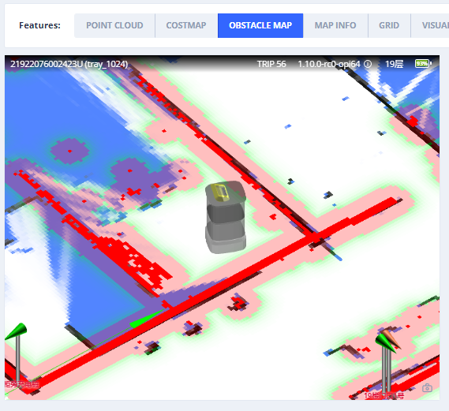
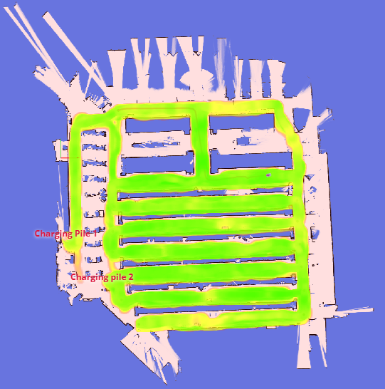
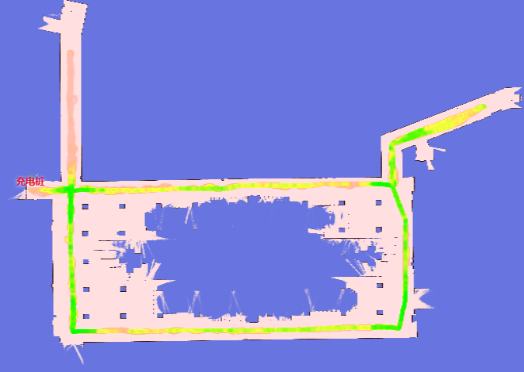

# Websocket Reference

## Map

Currently used map.


```json
{
  "topic": "/map",
  "stamp": 1660896129737,
  "resolution": 0.10000000149011612,
  "size": [182, 59],
  "origin": [-8.1, -4.8],
  "data": "iVBORw0KGgoAAAANSUhEUgAAALYAAAA7BAAAAA..." // Base64 encoded PNG file
}
```

## Obstacle Map

Only for debugging.



```
{
  "topic": "/maps/5cm/1hz",
  "stamp": 1660896742341,
  "resolution": 0.05000000074505806,
  "size": [
    200,
    200
  ],
  "origin": [
    -2.8,
    -6.2
  ],
  "data": "iVBORw0KGgoAAAANSUhEUgAAAMgAAADICA..." // based64 encoded PNG file
}
```

## Wheel State

```json
{
  "topic": "/wheel_state",
  "control_mode": "auto", // auto/remote/manual，对应自动、手推、远控
  "emergency_stop_pressed": true // 急停是否按下
}
```

## Positioning State

```json
{
  "topic": "/slam/state",
  "state": "positioning", // 'inactive/slam/positioning' 闲置/建图/定位
  "reliable": true,
  "inter_constraint_count": 20,
  "good_constraint_count": 20
}
```

## Vision Detected Objects

::: warning
Experimental Feature
:::

```ts
enum VisualObjectLabel {
  none = 0,
  person = 1, // 人
  platformHandTruck = 2, // 手推板车
  scaffold = 3, // 脚手架
  queueStand = 4, // 排队栏杆
  portableGrandstand = 5, // 移动式看台
}
```

```json
{
  "topic": "/vision_detected_objects",
  "boxes": [
    {
      "pose": { "pos": [0.32, 0.97], "ori": 0.0 }, // 物体的位置和朝向
      "dimensions": [0.0, 0.0, 0.0], // 物体的宽、长、高
      "value": 0.8005573153495789,
      "label": 1 // VisualObjectLabel
    },
    {
      "pose": { "pos": [0.63, 1.08], "ori": 0.0 },
      "dimensions": [0.0, 0.0, 0.0],
      "value": 0.5348057150840759,
      "label": 1
    },
    {
      "pose": { "pos": [0.51, 0.74], "ori": 0.0 },
      "dimensions": [0.0, 0.0, 0.0],
      "value": 0.41888049244880676,
      "label": 1
    }
  ]
}
```

## Battery Information


```json
{
  "topic": "/battery_state",
  "secs": 1653299708, // 时间戳
  "voltage": 26.3, // 电池电压
  "current": 3.6, // 电池电流。充电时，一般为负。运行时，一般为正。
  "percentage": 0.64, // 电量
  "power_supply_status": "discharging" // charging/discharing/full
}
```

## Current Pose

Current pose in world frame.

```json
{
  "topic": "/tracked_pose",
  "pos": [3.7325, -10.8525],
  "ori": -1.56 // 朝向。X轴正向为0。Y 轴正向为 pi/2
}
```

## Move Action State

Return the execution state of the latest move action.

```ts
enum ActionType
{
  none,
  standard,
  charge
  along_given_route, // move along a given track
  return_to_elevator_waiting_point, // used when failed to enter elevator
  pull_over // pull over to make space (for other robots to pass)
}

enum MoveState
{
  none,
  idle,
  moving,
  succeeded,
  failed,
  cancelled
}
```

```json
{
  "topic": "/planning_state",
  "action_id": 561,
  "action_type": "standard", // see ActionType
  "move_state": "moving", // see MoveState
  "target_poses": [
    {
      "pos": [4.08, 2.99],
      "ori": 0
    }
  ],
  "fail_reason": 0, // valid when move_state == failed
  "fail_reason_str": "none", // valid when move_state == failed
  "remaining_distance": 2.8750057220458984, // in meters

  // The pose of the current target
  "intent_target_pose": {
    "pos": [0, 0],
    "ori": 0
  }
}
```

## Lidar Point Cloud


The point cloud in world frame.

```json
{
  "topic": "/scan_matched_points2",
  "stamp": 1653302201889,
  "points": [
    [7.83, 3.84, 0.04],
    [7.8, 3.88, 0.04],
    [7.79, 4.14, 0.04]
    ...
  ]
}
```

## Route

Current route.


```json
{
  "topic": "/path",
  "stamp": 1653301966860,
  "positions": [
    [0.94, 0.27],
    [0.94, 0.25],
    [0.96, 0.25]
  ]
}
```

## Mapping Trajectory

Realtime trajectory during mapping.

```json
{
  "topic": "/trajectory",
  "points": [
    [2.0, 3.0],
    [2.1, 3.1],
    [2.4, 3.0],
    [2.7, 2.9],
    [3.0, 2.8],
    [3.6, 2.6],
    [3.7, 2.5],
    [3.9, 2.3],
    [4.1, 2.1],
    [3.9, -1.1],
    [3.8, -2.2]
  ]
}
```

## Alerts

Currently active alerts.


```json
{
  "topic": "/alerts",
  "alerts": [
    {
      "code": 6004,
      "level": "error",
      "msg": "Kernel temperature is higher than 80!"
    }
  ]
}
```

## Traveled Distance

::: warning
Experimental Feature
:::

```json
{
  "topic": "/platform_monitor/travelled_distance",
  "start_time": 1653303520, // 本次 move 起始时间
  "duration": 60, // 本次 move 执行时间
  "distance": 27.89, // 本次 move 移动距离
  "accumulated_distance": 5230.0 // 系统启动后运行总距离
}
```

## RGB Video Stream

h264 encoded data stream.

```json
{
  "topic": "/rgb_cameras/front/video",
  "stamp": 1653303702.821,
  "data": "AAAAAWHCYADAAb5Bv4yqqseHIsjRwL5E4C4uX/CmRcXVaxddV3zf5uZO..."
}
```

For Browser for Node. Use [jmuxer](https://github.com/samirkumardas/jmuxer) can decode it.


Currently topics: (Different devices may differ)

- `/rgb_cameras/front/video`
- `/rgb_cameras/back/video`
- `/rgb_cameras/front_augmented/video` Augmented video stream
  for debugging vision based object detection.


## RGB Image Stream

jpeg encoded image stream.

::: tip
Image stream is considerably larger than H264 video stream. For internet, please use video stream.
:::

```json
{
  "topic": "/rgb_cameras/front/compressed",
  "stamp": 1653303702.821,
  "format": "jpeg",
  "data": "YXNkZmFzZndlcndldHNhZGZhc2Rmd2V0cjJ5NDVqdHltNDU2..."
}
```

Currently topics: (Different devices may differ)

- `/rgb_cameras/front/compressed`
- `/rgb_cameras/back/compressed`

## Sensor Manager State

```ts
type PowerState =
  | 'awake' // operational
  | 'awakening' // Recovering from sleeping to awake. Usually lasts 2-3 seconds.
  | 'sleeping'; // when sleeping, some sensors are turned off.
```

```json
{
  "topic": "/sensor_manager_state",
  "power_state": "awake" // see PowerState
}
```

## Nearby Robots

It requires a dedicated hardware (optional installation).

```json
{
  "topic": "/nearby_robots",
  "robots": [
    {
      "uid": "xx",
      "trend": "",
      ""
    }
  ]
}
```

## Odom State

A debug topic, to visualize covariance of lidar odom。

```json
{
  "topic": "/odom_state",
  "lidar_odom_reliable": true,
  "lidar_odom_cov": [
    0.000023889469957794063,
    -0.00002311983917024918,
    -0.00002311983917024918,
    0.00005866867650183849
  ]
}
```

## External RGB Camera Data

If the robot isn't shipped with RGB cameras. One can install external cameras and feed the data back to the robot.
So monitoring and vision based functions can still work.

**Control Channel**

When receiving this topic, the peripheral device should:

1. Open the corresponding cameras
2. Set required resolution, fps
3. Send data back through the data channel

```json
{
  "topic": "/external_rgb_camera_control",
  "enabled_devices": [
    {
      "name": "Front Camera",
      "width": 320,
      "height": 240,
      "fps": 5,
      "external_data_topic": "/external_rgb_data/front"
    }
  ]
}
```

**Data Channel**

Use this channel to send RGB data to the robot.

```json
{
  "topic": "/external_rgb_data/front", // The topic, specified in the control channel's `external_data_topic`
  "format": "jpeg", // must be jpeg
  "stamp": 1655896161.012, // The timestamp of the image
  "data": "Aasdfwe3424..." // base64 encoded JPEG data
}
```

## Global Positioning State

The feedback of service `POST /services/start_global_positioning`.

```json
{
  "topic": "/global_positioning_state",
  "state": "succeeded",
  "score": "82.1",

  // If false, the pose is globally unique and can be trusted.
  // If true, the environment is not a good match
  // or pose is not globally unique thus should be verified by an human operator.
  "needs_confirmation": false,
  "pose": { "pos": [0.32, 0.97], "ori": 0.0 } // 物体的位置和朝向
}
```

## Device Info

Only for those clients which already established a websocket connection but don't want to make REST API requests.

Request:

```json
{ "topic": "/get_device_info_brief" }
```

Response:

```json
{
  "topic": "/device_info_brief",
  "rosversion": "1.15.11",
  "rosdistro": "noetic",
  "axbot_version": "master-pi64",
  "device": {
    "model": "waiter"
  },
  "baseboard": {
    "firmware_version": "22032218"
  },
  "wheel_control": {
    "device_type": "amps",
    "firmware_version": "amps_20211103"
  },
  "lidar": {
    "model": "ld06"
  },
  "bottom_sensor_pack": {
    "firmware_version": ""
  },
  "depth_camera": {
    "firmware_version": ""
  },
  "remote_params": {
    "tags": [
      "ihawk_crossfire",
      "RGB_external",
      "strongest_lidar_match",
      "mute_baseboard_com_output"
    ]
  }
}
```

## Environment Match Map

This map reflects how the point clouds matches the existing map.

Red indicates the environment has changed. If there is too much red, the map should be rebuilt.



Request:

```json
{ "enable_topic": "/env_match_map" }
```

Response:

```json
{
  "topic": "/env_match_map",
  "stamp": 1675326661.915,
  "resolution": 0.10000000149011612,
  "size": [579, 614],
  "origin": [-9.35, -34.75],
  "data": "iVBORw0KGgoAAAANSUhEUgAAAkMAA..."
}
```

## Environment Symmetry Map

This map reflects the degree of symmetry of point cloud against current environment.

Red indicates a featureless environment, like tunnel or spacious lobby.



Request:

```json
{ "enable_topic": "/env_symmetry_map" }
```

Response:

```json
{
  "topic": "/env_symmetry_map",
  "stamp": 1674993781.916,
  "resolution": 0.10000000149011612,
  "size": [579, 614],
  "origin": [-9.35, -34.75],
  "data": "iVBORw0KGgoAAAANSUhEUgAAAkMAAAJmCAAAAAB..."
}
```
