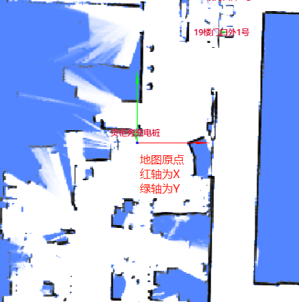

# 开始移动

要使机器人移动，必须满足两个前提条件：

1. 必须设置一张地图。
2. 必须给定一个初始位姿。

## 设置地图

您可以使用 [RobotAdmin](./robot_admin.md) 网站来设置机器人所在的地图。


或者，使用 [地图列表 API](../reference/maps.md#map-list) 查找地图 ID。
然后，使用 `POST /chassis/current-map` 将其设置为当前地图。

```bash
curl -X POST \
  -H "Content-Type: application/json" \
  -d '{"map_id": 286}' \
  http://192.168.25.25:8090/chassis/current-map
```

```json
{
  "id": 286,
  "uid": "616cd441e1209813dd4bb25d",
  "map_name": "-1层",
  "create_time": 1647503669,
  "map_version": 6,
  "overlays_version": 8
}
```

## 坐标系



在 `RobotAdmin` 中，两条箭头（红色代表 X 轴，蓝色代表 Y 轴）在地图原点相交。
这两条轴构成了一个正交直角坐标系。

地图上某点的坐标记为 $(x, y)$，表示距离原点的米数。

一个 `pose`（位姿）通常表示为：

```json
{
  "pos": [0.12, 0.85], // 位置
  "ori": 1.57 // 弧度表示的朝向。X轴正方向为 0，逆时针测量。
}
```

## 设置位姿

要移动机器人，必须提供一个初始位姿。

通常的做法是，建图从充电桩开始。
因此，机器人的初始位姿（在充电桩上）即成为地图的原点。

```bash
curl -X POST \
  -H "Content-Type: application/json" \
  -d '{"position": [0, 0, 0], "ori": 1.57}' \
  http://192.168.25.25:8090/chassis/pose
```

- `position: [0, 0, 0]` 表示 $x=0, y=0, z=0$。
- `ori: 1.57` ($\pi/2$) 表示机器人的朝向为 Y 轴正方向。

一旦地图和初始位姿都设置完毕，机器人将在 `RobotAdmin` 中显示如下：


## 开始移动

要移动机器人，请使用 `POST /chassis/moves` 创建一个移动动作。

```bash
curl -X POST \
  -H "Content-Type: application/json" \
  -d '{"type":"standard", "target_x":0.731, "target_y":-1.525, "target_z":0, "creator":"head-unit"}' \
  http://192.168.25.25:8090/chassis/moves
```

```json
{
  "id": 4409,
  "creator": "head-unit",
  "state": "moving",
  "type": "standard",
  "target_x": 0.731,
  "target_y": -1.525,
  "target_z": 0.0,
  "target_ori": null,
  "target_accuracy": null,
  "use_target_zone": null,
  "is_charging": null,
  "charge_retry_count": 0,
  "fail_reason": 0,
  "fail_reason_str": "None - None",
```
