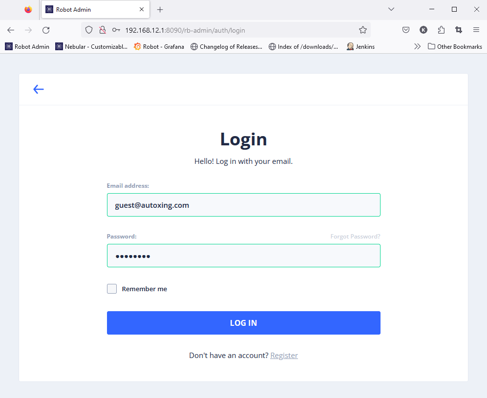
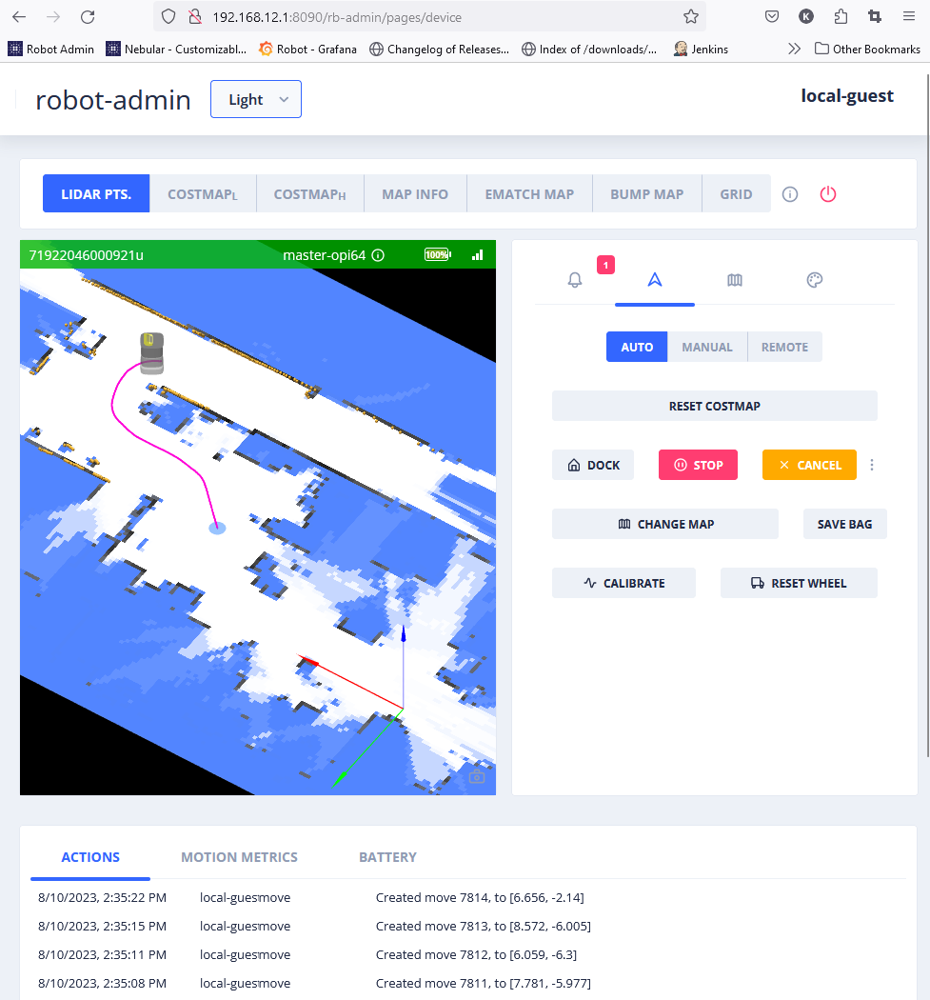
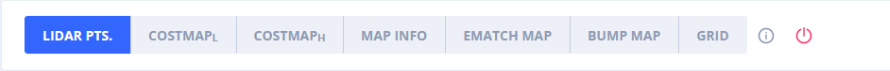
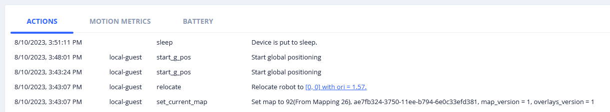
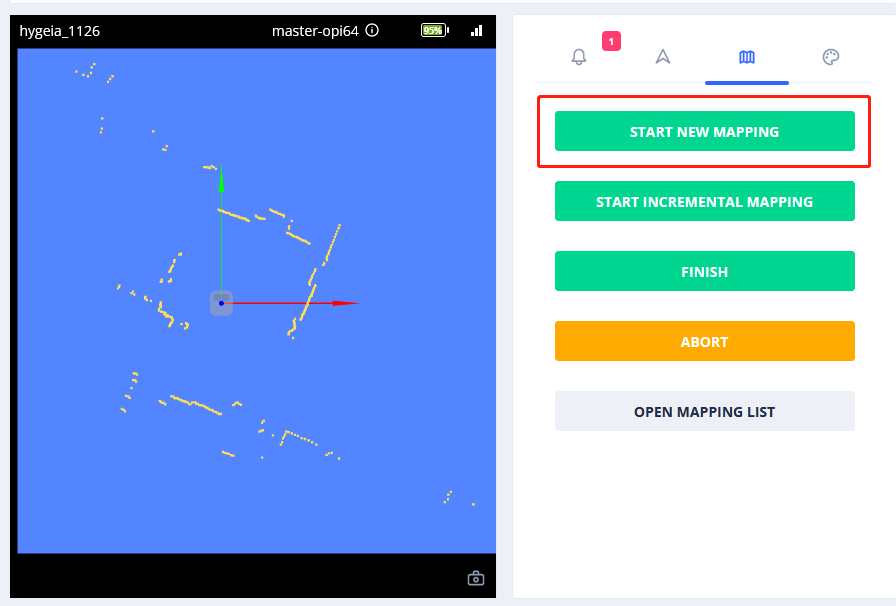
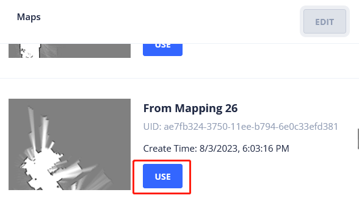
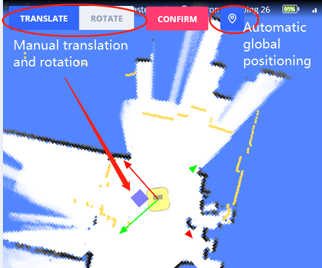

# Robot Admin (单机版)

Robot Admin（单机版）是一个纯前端网站（HTML + JavaScript），直接由机器人提供服务。

它通过机器人的 REST API 与机器人进行交互。通过观察它的操作，您可以快速学习如何利用这些 API。

这是一个可选软件包。安装后，可以通过 `http://机器人IP:8090/rb-admin/` 访问。

使用用户名和密码登录（默认通常为 `guest@autoxing.com` 和 `autoxing`）。
登录后，您可以执行各种任务，包括：

- 创建新地图
- 浏览现有地图并选择其中一张作为当前地图
- 设置机器人的当前位置
- 创建移动动作以导航机器人
- 可视化传感器数据（激光雷达点云、深度相机点云、RGB 相机回传等）
- 校准传感器
- 查看警报和动作日志
- 保存 bag 文件（用于错误报告）

## UI 概览

### 可视化主题栏

- LIDAR PTS - 激光雷达点。
- COSTMAP(l) - 低分辨率代价地图。
- COSTMAP(h) - 高分辨率代价地图。
- MAP INFO - 虚拟墙、充电桩、电梯区域等。
- EMATCH MAP - 环境匹配地图，显示自初始建图以来的环境变化程度。
- BUMP MAP - 可视化机器人在移动过程中感知到的颠簸程度。
- GRID - 1m x 1m 网格线。

### 控制选项卡

从左到右依次为：

- Alerts - 显示机器人警报。
- Control - 当此选项卡在 "AUTO"（自动）模式下处于活动状态时，您可以双击地图以移动机器人。
- Mapping - 用于创建新地图。
- More Visualization Options - 提供对更多传感器数据的访问。

### 动作面板

## 常用任务

### 远程创建新地图

1. 开启 `LIDAR PTs`。
2. 切换到第三个选项卡，点击 "START NEW MAPPING"（开始新建图）。机器人将进入**建图模式**。

3. 切换到第二个选项卡并选择 "Auto"（自动）模式。
4. 双击机器人周围的空闲空间（由白色区域指示）。
5. 持续移动机器人，直到地图构建完成。
6. 切回第三个选项卡：
   1. 如果只想临时使用地图而不保存，点击 "ABORT"（放弃）。
   2. 如果要永久保存地图，点击 "FINISH"（完成）。它将被存储在 "Mapping List"（扫描任务列表）中。

点击 "ABORT" 或 "FINISH" 后，机器人将切换到**定位模式**，允许您在刚才创建的地图中进行导航。

要重复使用新创建的地图：

1. 选择 "OPEN MAPPING LIST"（打开扫描任务列表）查看所有建图任务。
2. 在某个建图任务（例如 "mapping 26"）上点击 "SAVE"（保存），将其保存到 "Map List"（地图列表）中。
3. 切换到第二个选项卡，点击 "CHANGE MAP"（更换地图），然后在所需地图（例如 "Mapping 27"）上点击 "USE"（使用）。

### 设置机器人的当前位置

点击机器人即可显示“调整工具栏”。

**自动全局定位**

使用“自动全局定位”按钮自动确定机器人的位置。
在较大的地图上，这可能需要一些时间。

- 如果成功，机器人的位置将自动更新。
- 如果系统不确定，您必须在确认激光雷达点与地图完美对齐后，手动点击 "CONFIRM"（确认）。
- 如果系统无法确定位置，该过程将失败。

**手动定位**

点击 "TRANSLATE"（平移）或 "ROTATE"（旋转），然后拖动光标手动移动或旋转机器人。
