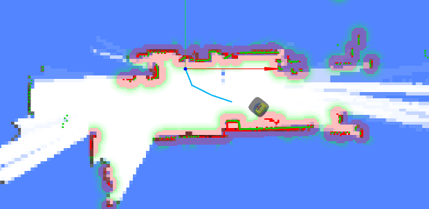
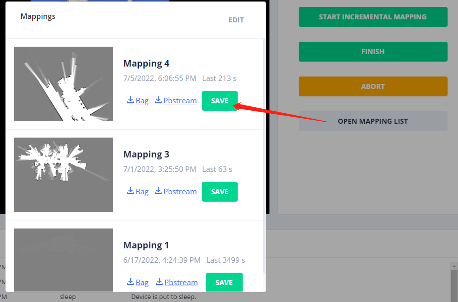

# 建图 (Mapping) API

通过建图 API，您可以：

1. 创建、完成、取消或删除建图任务。
2. 查看所有建图任务。
3. 将建图任务的产物保存为地图。

一个任务具有一种状态，可以是 `running` (运行中)、`finished` (已完成)、`cancelled` (已取消) 或 `failed` (失败)。

任务成功创建后，会进入 `running` 状态。
完成后，它将包含一个地图和一个数据包文件 (bag file)。该数据包文件包含建图过程中使用的传感器数据。

建图任务（在 `/mappings` 下）不能直接用于导航。您必须先将建图任务的产物保存到 `/maps` 中。

## 开始建图

```bash
curl -X POST \
  -H "Content-Type: application/json" \
  -d '{"continue_mapping": false}' \
  http://192.168.25.25:8090/mappings/
```

```
{
   "id":48,
   "thumbnail_url":null,
   "image_url":null,
   "grid_origin_x":0.0,
   "grid_origin_y":0.0,
   "grid_resolution":0.0,
   "url":"http://xxxx:10022/mappings/48",
   "start_time":1647520760,
   "end_time":null,
   "state":"running",
   "bag_id":null,
   "bag_url":null,
   "download_url":null
}
```

**请求参数**

```ts
interface MappingCreateRequest {
  // false (默认值)：创建一个新地图。
  // true：执行增量建图。
  // 如果为 true，将继承当前地图（及其坐标系）。
  continue_mapping: boolean;

  // (自 1.8.8 以后)
  // zero (默认值)：使用 x=0, y=0, ori=0 作为起点（开启一个新的坐标坐标系）。
  // current_pose：使用当前位姿作为起点（继承现有坐标系）。
  start_pose_type: 'zero' | 'current_pose';
}
```

## 建图过程的可视化

在建图过程中，使用 WebSockets 接收实时反馈：

- [当前位姿](./websocket.md#current-pose)
- [地图](./websocket.md#map)：定期更新。
- [轨迹](./websocket.md#mapping-trajectory)：轨迹历史记录，帮助您识别已访问过地图的哪些部分。
- [点云](./websocket.md#lidar-point-cloud) 和 [障碍物地图](./websocket.md#obstacle-map)：这些有助于在远程建图期间避免碰撞。

它们的渲染效果如下：



## 完成或取消建图

```bash
curl -X PATCH \
  -H "Content-Type: application/json" \
  -d '{"state": "finished"}' \
  http://192.168.25.25:8090/mappings/current
```

**请求参数**

```ts
interface MappingFinishRequest {
  state: 'finished' | 'cancelled'; // 完成或取消建图任务

  // (自 1.8.8 以后)
  // false (默认值)：保存整个地图。
  // true：仅保存地图的增量部分（仅适用于增量建图）。
  new_map_only: boolean;
}
```

建图任务完成后，任务产物会被保存。
随后您可以使用 `/mappings/:id` 请求获取它们。

## 建图列表

```bash
curl http://192.168.25.25:8090/mappings/
```

```json
[
   {
      "id":48,
      "url":"http://192.168.25.25:8090/mappings/48",
      "grid_origin_x":-8.050000190734863,
      "grid_origin_y":-5.650000095367432,
      "grid_resolution":0.05,     
      "start_time":1647520760,
      "end_time":1647520995,
      "state":"finished",
      "bag_id":27,

      //////////////////////////////
      // 主要数据 (Main data)
      //////////////////////////////

      // 二进制地图数据文件。支持基于 RANGE + ETAG 的下载。
      "pbstream_url":"http://192.168.25.25:8090/mappings/48.pbstream",  
      // PNG 图像
      "image_url":"http://192.168.25.25:8090/mappings/48.png",
      // 陆标等
      "properties_url": "http://tunnel.autoxing.com:21044/mappings/48/properties.json", 

      //////////////////////////////
      // 辅助数据 (Auxiliary data)
      //////////////////////////////
      
      // 较小尺寸的 PNG 图像
      "thumbnail_url":"http://192.168.25.25:8090/mappings/48/thumbnail",
      // 该建图任务的轨迹
      "trajectories_url": "http://192.168.25.25:8090/mappings/48/trajectories.json",
      // 用于 SLAM 调试
      "bag_url":"http://192.168.25.25:8090/bags/48.bag",

      //////////////////////////////
      // 已废弃 (Obsolete)
      //////////////////////////////

      // 已废弃。JSON 格式（base64 编码）的地图数据和图像。不适合大地图。
      "download_url":"http://192.168.25.25:8090/mappings/48/download", 
   },
   {
    ...
   }
]
```

## 建图详情

```bash
curl http://192.168.25.25:8090/mappings/48
```

```json
{
  "id": 48,
  "thumbnail_url": "http://192.168.25.25:8090/mappings/48/thumbnail",
  "image_url": "http://192.168.25.25:8090/mappings/48.png", // Base64 编码的地图图像 (PNG，用于显示)
  "grid_origin_x": -8.050000190734863,
  "grid_origin_y": -5.650000095367432,
  "grid_resolution": 0.05,
  "url": "http://192.168.25.25:8090/mappings/48",
  "start_time": 1647520760,
  "end_time": 1647520995,
  "state": "finished", // 当前状态：running (运行中), finished (已完成), cancelled (已取消), failed (失败)
  "bag_id": 27,
  "bag_url": "http://192.168.25.25:8090/bags/27.bag",
  "download_url": "http://192.168.25.25:8090/mappings/48/download", // 获取 Base64 编码的地图数据（二进制，用于定位）
  "trajectories_url": "http://192.168.25.25:8090/mappings/48/trajectories.json",
  "landmark_url": "http://192.168.25.25:8090/mappings/48/landmarks.json" // 自 2.11.0 起支持
}
```

## 获取建图轨迹

```bash
curl http://192.168.25.25:8090/mappings/48/trajectories.json
```

```json
[
  {
    "id": 0,
    "coordinates": [
      [0, 0.01],
      [0.01, 0.11],
      [0, 0.01],
      [0.01, 0.11],
      [-0.12, 0.17]
    ]
  }
]
```

## 直接将建图产物保存为地图

机器人只有在地图被保存后才能加载并将其用于导航。
此方法（使用 `mapping_id`）比[上传整个地图](./maps.md#create-a-map)及其所有字段更加高效。



**请求**

```bash
curl -X POST http://192.168.25.25:8090/maps/
```

```json
{
  "map_name": "From Mapping 4", // 为地图提供一个名称
  "mapping_id": 4 // 建图动作的 ID
}
```

**响应**

```json
{
  "id": 119, // 新创建地图的 ID。使用此 ID 将其加载到机器人上。
  "uid": "9b94ac16-239b-11ed-9446-1e49da274768",
  "map_name": "From Mapping 4",
  "create_time": 1657015615,
  "map_version": 1,
  "overlays_version": 1,
  "thumbnail_url": "http://192.168.25.25:8090/maps/119/thumbnail",
  "image_url": "http://192.168.25.25:8090/maps/119.png",
  "url": "http://192.168.25.25:8090/maps/119"
}
```

## 删除建图任务

```bash
curl -X DELETE http://192.168.25.25:8090/mappings/1
```

## 删除所有建图任务

```bash
curl -X DELETE http://192.168.25.25:8090/mappings/
```

## 获取陆标 (Landmarks)

自 2.11.0 起支持

```bash
curl http://192.168.25.25:8090/mappings/48/landmarks.json
```

```json
[
  {
    "id": "landmark_1",
    "pos": [1.234, 2.345]
  },
  {
    "id": "landmark_2",
    "pos": [5.234, 8.345]
  }
]
```
