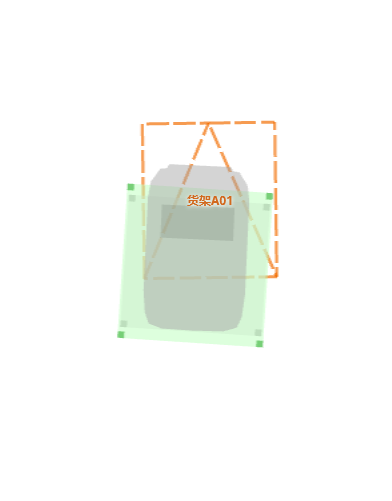
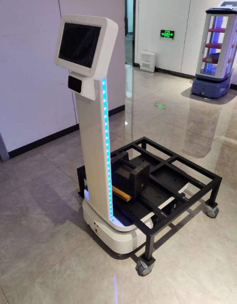
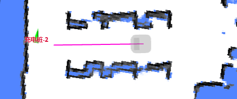

# 移动 (Move) API

## 创建移动动作

```bash
curl -X POST \
  -H "Content-Type: application/json" \
  -d '{"creator": "xxx", "type": "standard" ...}' \
  http://192.168.25.25:8090/chassis/moves
```

**返回**

```json
{
  "id": 5 // 新创建动作的 ID。
}
```

**请求参数**

```ts
interface MoveActionCreate {
  creator: string; // 动作的发起者（仅用于诊断目的）。
  type:
    | 'standard'
    | 'charge' // 前往充电桩并对接。
    | 'return_to_elevator_waiting_point'
    | 'enter_elevator'
    | 'leave_elevator' // 已废弃。请勿使用。
    | 'along_given_route' // 沿着指定路径移动。
    | 'align_with_rack' // 钻入货架下方（以便后续顶升）。
    | 'to_unload_point' // 移动到货架卸货点（以便后续落下）。
    | 'follow_target'; // 跟随移动目标。
  target_x?: number;
  target_y?: number;
  target_z?: number;
  target_ori?: number;
  target_accuracy?: number; // 单位：米（可选）。

  // 要遵循的路径。
  //
  // 仅当 `type` 为 `along_given_route` 时有效。
  // 以逗号分隔的坐标列表字符串，
  // 格式为 "x1, y1, x2, y2"。
  route_coordinates?: string;

  // 沿着指定路径移动时，绕过障碍物的允许偏航距离。
  //
  // 仅当 `type` 为 `along_given_route` 时有效。
  // 当指定为 0 时，机器人遇到障碍物会始终停止并等待，而不会尝试绕行。
  detour_tolerance?: number;

  // 如果为 true，当机器人进入 `target_accuracy` 半径范围内时，动作将立即成功。
  use_target_zone?: boolean = false;

  charge_retry_count?: number; // `charge` 动作失败前的重试次数。

  rack_area_id: string; // 执行点到区域或区域到区域的货物移动动作时，提供目标货架区域 ID。

  properties?: { // 可选：自 2.11.0 起支持
    inplace_rotate?: boolean; // 可选。自 2.11.0 起支持：严格原地旋转，不带任何线速度。

    // 可选。货架堆叠层数的索引。
    // 用于 type = "align_with_rack" 和 "to_unload_point"。
    rack_layer?: number; 
  }
}
```

### 顶升设备

自 2.7.0 起，新增了一个型号（代号为 **Longjack**），它可以钻入货架下方并将其顶起。

在典型的点到点任务中，机器人应使用以下命令序列来装载货物并将其卸载到另一个位置：

1. **钻入货架下方**：创建一个 `type=align_with_rack` 的移动动作以钻入货架下方。
2. **升起顶升设备**：当移动成功时，调用 `/services/jack_up`。
   1. 顶升设备的进度通过 [Jack State Topic (顶升状态话题)](../reference/websocket.md#jack-state) 报告。
   2. 当顶升设备完全升起时，机器人的轮廓 (footprint) 将扩大以适配货架的轮廓。
   更新后的轮廓可以通过 [Robot Model Topic (机器人模型话题)](../reference/websocket.md#robot-model) 获取。
3. **移动到卸货点**：顶升设备完全升起后，创建另一个 `type=to_unload_point` 的移动动作以移动到卸货点。
4. **降下顶升设备**：调用 `/services/jack_down` 进行卸货。
5. （可选）创建下一个移动动作。机器人在发起下一个动作前会先移开货架点。

| Robot Admin 截图        | 实拍图               |
| ----------------------- | -------------------- |
|  |  |

:::warning 注意
必须正确配置某些参数才能确保安全运行。参见 [rack.specs](./system_settings.md#rackspecs)
:::

### 点到区域移动

除了将货架或托盘从一个点移动到另一个点的点到点移动外，我们还支持：

* **点到区域移动**：当预先不知道目标区域哪些点位是空闲时，这是最常用的移动方式。
* **区域到区域移动**：用于将一个区域内的所有货架或托盘移动到另一个区域。

在建图平台上，应添加货架区域多边形。该区域内的所有货架点都被视为该组的一部分。

收到 `type=to_unload_point` 且 `rack_area_id={SOME_ID}` 的移动动作后，机器人会扫描该区域内的所有货架点，并移动到第一个空闲点位。如果所有点位都被占用，移动失败并报错 `NoFreeSpaceInRackArea`。

引入了几个新的失败原因，例如：

* `InvalidRackAreaId`
* `InvalidRackArea`
* `UnknownRackSpaceState`
* `NoRackInRackArea`
* `AlignFailedInRackArea`
* `NoFreeSpaceInRackArea`
* `FailedToUnloadInRackArea`

### 区域到区域移动

创建一个 `type=align_with_rack` 且 `rack_area_id={SOME_ID}` 的移动动作；机器人会巡检源区域，找到第一个存放有货架的货架点，并与其对接。

### 严格遵循给定路线

当提供 `route_coordinates` 且 `detour_tolerance=0` 时，机器人会尽可能紧密地遵循路线，且不会尝试避障（只会停在障碍物前）。

这常用于库存盘点。



### 跟随目标

此动作指示机器人跟随一个移动的目标。

```
curl -X POST
  -H "content-type: application/json" \
  --data '{"type":"follow_target"}' \
  http://192.168.25.25:8090/chassis/moves
```

创建此动作后，用户应通过 WebSocket 话题 `/follow_target_state` 发送目标位姿：参见 [Follow Target](../reference/websocket.md#follow-target-state)


## 获取移动动作详情

```bash
curl http://192.168.25.25:8090/chassis/moves/4409
```

```json
{
  "id": 4409,
  "creator": "robot-admin-web",
  "state": "cancelled",
  "type": "standard",
  "target_x": 0.7310126134385344,
  "target_y": -1.5250144001960249,
  "target_z": 0.0,
  "target_ori": null,
  "target_accuracy": null,
  "use_target_zone": null,
  "is_charging": null,
  "charge_retry_count": 0,
  "fail_reason": 0, // 参见 MoveFailReason
  "fail_reason_str": "None - None",
  "fail_message": "",
  "create_time": 1647509573,
  "last_modified_time": 1647509573
}
```

**响应字段说明**

```ts
interface MoveAction extends MoveActionCreate {
  state: 'idle' | 'moving' | 'succeeded' | 'failed' | 'cancelled';
  create_time: number; // Unix 时间戳 (例如：1647509573)。
  last_modified_time: number; // Unix 时间戳 (例如：1647509573)。
  fail_reason: number; // 失败代码。仅当 state="failed" 时有效。
  // 用于调试的内部失败消息。仅当 state="failed" 时有效。
  fail_reason_str: string;
  // 用于调试的中文内部失败消息。仅当 state="failed" 时有效。
  fail_message: string;
}
```

## 移动动作列表

所有移动动作的历史记录。

```bash
curl http://192.168.25.25:8090/chassis/moves
```

```json
[
  {
    "id": 4409,
    "creator": "robot-admin-web",
    "state": "cancelled",
    "type": "standard",
    "fail_reason": 0, // 参见 MoveFailReason
    "fail_reason_str": "None - None",
    "fail_message": "",
    "create_time": 1647509573,
    "last_modified_time": 1647509573
  },
  {
    "id": 4408,
    "creator": "control_unit",
    "state": "succeeded",
    "type": "none",
    "fail_reason": 0, // 参见 MoveFailReason
    "fail_reason_str": "None - None",
    "fail_message": "",
    "create_time": 1647427995,
    "last_modified_time": 1647428509
  }
]
```

## 移动状态反馈

使用 WebSocket 话题 `/planning_state` 接收移动状态的更新。

```json
{
  "topic": "/planning_state",
  "move_state": "moving",
  "target_poses": [
    {
      "pos": [2.3, 20.82],
      "ori": 0
    }
  ],
  "charger_pose": {
    "pos": [0, 0],
    "ori": 0
  },
  "going_back_to_charger": false,
  "action_id": 4410, // 当前正在执行（或最后一次）移动动作的 ID。
  "fail_reason": 0, // 参见 MoveFailReason
  "fail_reason_str": "none",
  "remaining_distance": 3.546117067337036,
  "move_intent": "none",
  "intent_target_pose": {
    "pos": [0, 0],
    "ori": 0
  },
  "stuck_state": "none"
}
```

## 取消当前移动动作

```bash
curl -X PATCH \
  -H "Content-Type: application/json" \
  -d '{state: "cancelled"}' \
  http://192.168.25.25:8090/chassis/moves/current
```

```json
{ "state": "cancelled" }
```

## 移动失败原因

`fail_reason` 字段是一个数字代码，指示移动动作失败的原因。

```ts
enum MoveFailReason
{
  none = 0, // 无
  unknown = 1, // 未知原因
  GetMapFailed = 2, // 获取地图失败 (WorldMap)
  StartingPointOutOfMap = 3,  // 起点在地图外
  EndingPointOutOfMap = 4, // 终点在地图外
  StartingPointNotInGround = 5, // 起点不在可行驶区域
  EndingPointNotInGround = 6, // 终点不在可行驶区域
  StartingEqualEnding = 7, // 起点和终点相同
  CalculateGlobalPathExtendedDataError = 8, // 计算全局路径扩展数据失败
  CalculationFailed = 9, // 道路不通
  CalculationTimeout = 10, // 计算超时
  NoGlobalPath = 11, // 无可用全局路径
  NotGrabStartIndexOnGlobalPath = 12, // 未能在全局路径上抓取起点
  NotGrabEndIndexOnGlobalPath = 13, // 未能在全局路径上抓取终点
  PlanningTimeout = 14, // 路径规划长时间不成功
  MoveTimeout = 15, // 路径规划成功，移动超时
  ControlCostmapError = 16, // 局部避障地图数据错误，传感器数据异常
  PowerCableConnected = 17, // 当前正连接线缆充电
  RotateTimeout = 18, // 旋转超时
  ChargeRetryCountExceeded = 100, // 充电重试次数超限
  ChargeDockDetectionError = 101, // 充电桩检测错误
  ChargeDockSignalError = 102, // 未收到充电桩对接成功信号
  InvalidChargeDock = 103, // 充电桩位置无效
  AlreadyInCharging = 104, // 当前已在充电中
  NoChargeCurrent = 105, // 接触后长时间未收到充电电流
  InvalidCabinetPos = 200, // 柜体位置无效
  CabinetDetectionError = 201, // 柜体检测错误
  NoDockWithConveyer = 202, // 当前未与接驳线对接
  NoApproachConveyer = 203, // 当前未靠近接驳线
  ElevatorPointOccupied = 300, // 电梯点被占用
  ElevatorClosed = 301, // 电梯已关闭
  ElevatorPointObscuredTimeout = 302, // 电梯点长时间被遮挡
  ElevatorPointOccupancyDetectionTimeout = 303, // 电梯点占用检测超时
  ElevatorEnterProgressUpdateTimeout = 304, // 进电梯进度更新超时
  InvalidTrackPoints = 400, // 轨迹点无效（输入坐标数不是偶数或轨迹点数 < 2）
  TooFarFromStartOfTrack = 401, // 距离轨迹起点太远
  InvalidRackDetectionPos = 500, // 货架检测点无效
  RackDetectionError = 501, // 货架检测错误
  RackRetryCountExceeded = 502, // 对接重试次数超限
  UnloadPointOccupied = 503, // 卸货点被占用
  UnloadPointUnreachable = 504, // 卸货点不可达
  RackMoved = 505, // 货架发生了明显移动
  JackInUpState = 506, // 顶升处于升起状态
  InvalidRackAreaId = 507, // 货架区域 ID 无效
  InvalidRackArea = 508, // 货架区域无效（无货架位）
  UnknownRackSpaceState = 509, // 货架空间状态未知
  NoRackInRackArea = 510, // 货架区域内无货架
  AlignFailedInRackArea = 511, // 在有货架的区域内对接失败
  NoFreeSpaceInRackArea = 512, // 货架区域内无空闲空间
  FailedToUnloadInRackArea = 513, // 在有空闲货架位的区域内卸货失败
  FollowFailed = 600, // 跟随目标丢失
  PoiDetectionError = 700, // POI 检测错误
  PoiUnreachable = 701, // POI 不可达
  BarcodeDetectionError = 702, // 条码检测错误
  PlatformAlertError = 1000, // 系统异常
  ServiceCallError = 1001, // 服务调用错误 (restapi 使用层)
  InternalError = 1002, // 内部 ASSERT 错误
  MapChanged = 1003, // 任务执行期间地图发生变化或被清除
  MoveActionTypeDeprecated = 1004, // 接口已废弃
}
```

更及时的版本请访问 [此 URL](https://rb-admin.autoxing.com/api/v1/static/move_failed_reason.json)。
