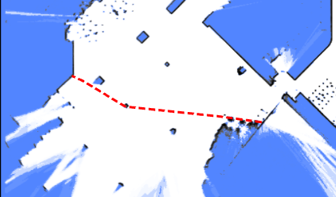
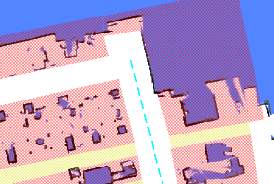
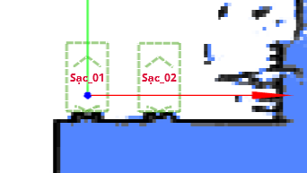
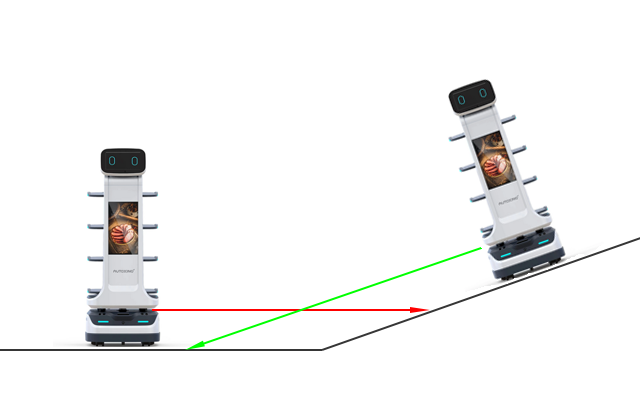

# 叠加层 (Overlays)

地图的 `overlays` 字段采用 GeoJSON 格式。它包含虚拟墙、虚拟区域、自动门、停靠点、货物装载点等。

要更新地图的叠加层，请参阅[修改地图](./maps.md#修改地图)。

顶层格式为：

```json
{
  "type": "FeatureCollection",
  "features": [
    {}, // 特征 1
    {}, // 特征 2
    {} // 特征 3
  ]
}
```

每个特征 (feature) 可以是点、折线或多边形。例如，这是一个多边形：

```json
{
  "type": "FeatureCollection",
  "features": [
    {
      "id": "SampleGate",
      "type": "Feature",
      "properties": {
        "regionType": 4,
        "mac": "30C6F72FAE1C"
      },
      "geometry": {
        "type": "Polygon",
        "coordinates": [
          [
            [-2.702, -5.784],
            [-1.007, -5.827],
            [-1.053, -6.348],
            [-2.546, -6.385]
          ]
        ]
      }
    }
  ]
}
```

## 虚拟墙与虚拟区域

虚拟墙和虚拟区域用于防止机器人进入特定区域。

**虚拟墙**是 `LineString` 特征。它们防止机器人从一侧穿过到另一侧，常用于引导全局路径计算。



```json
{
  "id": "19f0684fdf2b1695054df052e002d8f6",
  "type": "Feature",
  "properties": {
    "lineType": "2",
    "mapOverlay": true
  },
  "geometry": {
    "type": "LineString",
    "coordinates": [
      [-35.0222214524365, -14.968376602837452],
      [-35.094466030898275, -22.120589758429787],
      [2.4727142286451453, -22.554057221952917],
      [2.54495880739114, -15.329599487756695],
      [-35.0222214524365, -15.112865751092386]
    ]
  }
}
```

**虚拟区域**比虚拟墙更具限制性；如果机器人意外进入虚拟区域，它将无法向任何方向移动。



```json
{
  "id": "4d14040ea1ee7dd2e1d778f04a224d7a",
  "type": "Feature",
  "properties": {
    "blocked": false,
    "mapOverlay": true,
    "regionType": "1"
  },
  "geometry": {
    "type": "Polygon",
    "coordinates": [
      [
        [-87.30882859651956, -43.42832073191971],
        [-86.96655334631487, -24.85988841115727],
        [0.22327395043930665, -25.754819491083936],
        [0.22327395043930665, -44.23768299574249],
        [-87.30882859651956, -43.42832073191971]
      ]
    ]
  }
}
```

## 清除区域 (Free Space)

清除区域用于清除地图上的某个区域，允许机器人进入这些区域。
它们通常用于在地图创建后移除多余的障碍物。

```json
{
  "id": "e4d544e92262c538dc31e116b630043b",
  "type": "Feature",
  "properties": {
    "blocked": false,
    "mapOverlay": true,
    "regionType": "12"
  },
  "geometry": {
    "type": "Polygon",
    "coordinates": [
      [
        [1.1439716297445557, -16.400667528273516],
        [3.5214924133697423, -16.438682980748354],
        [2.9970246447419413, -25.260207920183575],
        [0.6399114661803651, -25.07582059422475],
        [1.1439716297445557, -16.400667528273516]
      ]
    ]
  }
}
```

## 充电桩 (Charger)

充电桩与 `charge` 移动动作类型配合使用。



```json
{
  "id": "642562bcf0e02ee8aff7dea7",
  "type": "Feature",
  "geometry": {
    "type": "Point",
    "coordinates": [0, 0]
  },
  "properties": {
    "deviceIds": ["6181307902152yI"],
    "dockingPointId": "65655d96f0e02ee8afc9cc5e",
    "mapOverlay": true,
    "name": "sac_01",
    "type": "9",
    "yaw": 90
  }
}
```

## 自动门

定义自动门后，机器人可以开启其路径上的门。
门由多边形表示，且必须包含 `mac` 属性。

:::warning 注意
多边形必须包含门移动的所有区域。
如果区域太小，门在开启时可能会与正在等待的机器人发生碰撞。
:::

```json
{
  "type": "Feature",
  "properties": {
    "regionType": 4,
    "mac": "30C6F72FAE1C"
  },
  "geometry": {
    "type": "Polygon",
    "coordinates": [
      [
        [-2.702, -5.784],
        [-1.007, -5.827],
        [-1.053, -6.348],
        [-2.546, -6.385]
      ]
    ]
  }
}
```

## 货物点 (Cargo Point)

类似于充电桩，此点指示机器人可以在何处找到货架进行装载或卸载。
它应与 `align_with_rack` 和 `to_unload_point` 移动动作类型配合使用。

## 条码 (Barcode)

[条码](./services.md#barcode)用于唯一确定机器人的全局位姿。

```json
{
    "id": "d43d15cf4e4ad0bd2a24891badd74891",
    "type": "Feature",
    "properties": {
        "mapOverlay": true,
        "name": "Some user defined name",
        "barcodeId": "D2_29",
        "type": "37",
        "yaw": "177.8"
    }
    "geometry": {
        "coordinates": [
            -1.052,
            -5.485
        ],
        "type": "Point"
    }
}
```

## 激光雷达拟态区域 (LiDAR Deceitful Area)

在地形不平坦的区域，2D 激光雷达可能会持续扫到地面，并将其误认为墙壁。



添加“激光雷达拟态区域”可以帮助解决此问题。
当经过这些区域时，机器人将优先考虑轮式里程计而不是激光雷达观测值。

```json
{
  "type": "Feature",
  "properties": {
    "regionType": 8
  },
  "geometry": {
    "type": "Polygon",
    "coordinates": [
      [
        [-2.702, -5.784],
        [-1.007, -5.827],
        [-1.053, -6.348],
        [-2.546, -6.385]
      ]
    ]
  }
}
```

## 陆标 (Landmarks)

自 2.11.0 起支持

[陆标](./landmarks.md)是在建图过程中收集的。
只有当它们存储在地图叠加层中时，才能用于定位。

```json
{
  "type": "Feature",
  "properties": {
    "type": "39",
    "landmarkId": "landmark_1"
  },
  "geometry": {
    "type": "Point",
    "coordinates": [-2.702, -5.784]
  }
}
```
