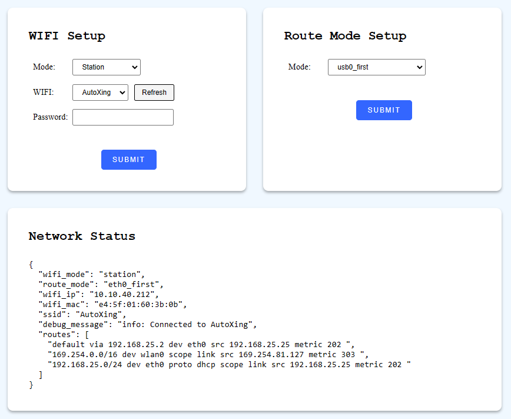
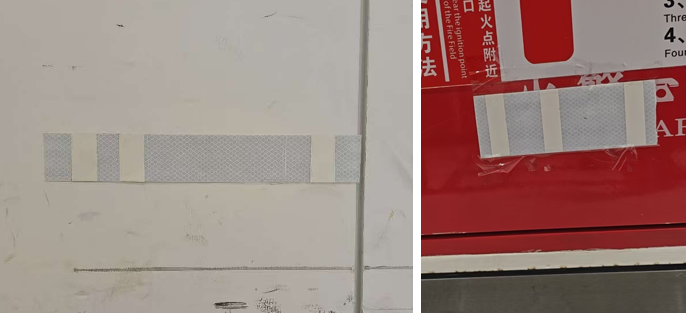
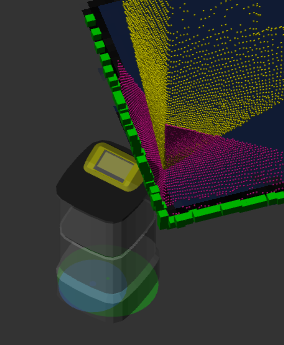
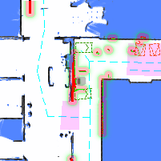

# 服务 (Service) API

## IMU 重新校准 (Recalibrate IMU)

发起 IMU 校准。在此过程中，机器人必须完全静止在坚硬、平坦的地面上。

```bash
curl -X POST \
  -H "Content-Type: application/json" \
  http://192.168.25.25:8090/services/imu/recalibrate
```

此服务调用仅触发校准；实际过程通常需要 10 到 20 秒才能完成。

校准完成后，将通过 `/action` WebSocket 话题发送通知。

**成功输出示例：**

```json
{
  "topic": "/action",
  "timestamp": 1681733608.653,
  "email": "",
  "username": "",
  "deviceName": "718220110000909",
  "action": "recalibrate_imu",
  "message": "IMU calibration succeeded"
}
```

**失败输出示例：**

```json
{
  "topic": "/action",
  "timestamp": 1681733580.702,
  "email": "",
  "username": "",
  "deviceName": "718220110000909",
  "action": "recalibrate_imu",
  "message": "error: IMU calibration failed. Failed to rotate to right"
}
```

## 设置控制模式 (Set Control Mode)

```bash
curl -X POST \
  -H "Content-Type: application/json" \
  -d '{"control_mode": "auto"}' \
  http://192.168.25.25:8090/services/wheel_control/set_control_mode
```

**参数**

```ts
class SetControlModeRequest {
  control_mode: 'auto' | 'manual' | 'remote';
}
```

使用 `/wheel_state` WebSocket 话题监控当前的控制模式和车轮状态。

```bash
$ wscat -c ws://192.168.25.25:8090/ws/v2/topics
> {"enable_topic": "/wheel_state"}
< {"topic": "/wheel_state", "control_mode": "auto", "emergency_stop_pressed": true }
```

## 设置或清除急停 (Emergency Stop)

```bash
curl -X POST \
  -H "Content-Type: application/json" \
  -d '{"enable": true}' \
  http://192.168.25.25:8090/services/wheel_control/set_emergency_stop
```

**参数**

```ts
class SetEmergencyStopRequest {
  enable: boolean;
}
```

使用 `/wheel_state` WebSocket 话题监控急停状态。

```bash
$ wscat -c ws://192.168.25.25:8090/ws/v2/topics
> {"enable_topic": "/wheel_state"}
< {"topic": "/wheel_state", "control_mode": "auto", "emergency_stop_pressed": true }
```

## 重启服务 (Restart Services)

重启机器人上所有的软件服务。

```bash
curl -X POST \
  -H "Content-Type: application/json" \
  http://192.168.25.25:8090/services/restart_service
```

## 关机或重启设备 (Shutdown or Reboot)

```bash
curl -X POST \
  -H "Content-Type: application/json" \
  -d '{"target": "main_power_supply", reboot: false}' \
  http://192.168.25.25:8090/services/baseboard/shutdown
```

**参数**

```ts
class ShutdownRequest {
  target:
    | 'main_computing_unit' // 仅重启或关闭主计算板。
    | 'main_power_supply'; // 重启或关闭整个设备。
  reboot: boolean; // true 为重启，false 为关机。
}
```

## 清除车轮错误 (Clear Wheel Errors)

```bash
curl -X POST http://192.168.25.25:8090/services/wheel_control/clear_errors
```

## 清除翻倒错误 (Clear Flip Error)

错误 `8004` (翻倒错误) 标识发生了严重问题，例如机器人已倾覆。
这需要人工检查。问题解决后，使用此服务清除错误并使机器人恢复到可运行状态。

```bash
curl -X POST http://192.168.25.25:8090/services/monitor/clear_flip_error
```

## 清除侧滑错误 (Clear Slide Error)

:::warning 警告
实验性功能
:::

错误 `2008` (侧滑错误) 表示机器人可能与隐形障碍物发生了显著碰撞。清除此错误前需要进行人工检查。

```bash
curl -X POST http://192.168.25.25:8090/services/monitor/clear_slipping_error
```

## 开启或关闭激光雷达电源

```bash
curl -X POST \
  -H "Content-Type: application/json" \
  -d '{"action": "power_on"}' \
  http://192.168.25.25:8090/services/baseboard/power_on_lidar
```

**参数**

```ts
class PowerOnRequest {
  action: 'power_on' | 'power_off';
}
```

## 开启或关闭深度相机电源

```bash
curl -X POST \
  -H "Content-Type: application/json" \
  -d '{"enable": true}' \
  http://192.168.25.25:8090/services/depth_camera/enable_cameras
```

**参数**

```ts
class EnableDepthCameraRequest {
  enable: boolean;
}
```

## 配置 Wi-Fi

在热点 (AP) 模式和基站 (Station) 模式之间切换 Wi-Fi。

```bash
curl -X POST \
  -H "Content-Type: application/json" \
  -d '{"mode": "station", "ssid":"xxxxxxxxx", "psk": "xxxxx"}' \
  http://192.168.25.25:8090/services/setup_wifi
```

**参数**

```ts
interface SetupWifiRequest {
  mode: 'ap' | 'station';
  ssid?: string; // SSID，Station 模式下必填
  psk?: string; // Wi-Fi 预共享密钥，Station 模式下必填

  route_mode?:
    | 'eth0_first'
    | 'wlan0_first'
    | 'usb0_first'
    | 'wlan0_usb0_auto_first';
}
```

## 设置路由模式 (Set Route Mode)

配置机器人底盘的路由表规则。

```bash
curl -X POST \
  -H "Content-Type: application/json" \
  -d '{"mode": "xxx"}' \
  http://192.168.25.25:8090/services/set_route_mode
```

**参数**

```ts
interface RouteModeRequest {
  mode: 'eth0_first' | 'wlan0_first' | 'usb0_first' | 'wlan0_usb0_auto_first';
}
```

`route_mode`: 决定网络接口在路由表中的优先级：

- `eth0_first`: 如果可用，将 `eth0` 设置为默认路由。
- `wlan0_first`: 如果可用，将 `wlan0` 设置为默认路由。
- `usb0_first`: 如果可用，将 `usb0` 设置为默认路由。
- `wlan0_usb0_auto_first`: 基于 `ping` 结果：如果 `wlan0` 具有互联网连接，则将其用作默认路由；否则，使用 `usb0`。

局域网内还提供了一个用于网络配置的静态 HTML 页面：http://192.168.25.25:8090/wifi_setup



## 唤醒设备 (Wake Up the Device)

将机器人从睡眠状态唤醒。如果机器人已处于唤醒状态，此命令无效。

```bash
curl -X POST http://192.168.25.25:8090/services/wake_up_device
```

监控 [Sensor Manager State (传感器管理状态)](./websocket.md#sensor-manager-state) WebSocket 话题以获取睡眠、唤醒或正在唤醒的状态。

## 开始全局定位 (Start Global Positioning)

```bash
curl -X POST \
  -H "Content-Type: application/json"
  http://192.168.25.25:8090/services/start_global_positioning
```

**参数**

```ts
interface StartGlobalPositioningRequest {
  use_barcode?: boolean; // 默认为 true。
  use_base_map_match?: boolean; // 默认为 true。
}
```

反馈可以通过 [Global Positioning State (全局定位状态)](./websocket.md#global-positioning-state) WebSocket 话题进行监控。

### 条码 (Barcode)



条码是由交错的反光和非反光表面组成的标记。
站点中的每个条码都包含一个唯一的 ID，使机器人在检测到条码时能够毫不含糊地确定其确切位置。

当 `use_barcode` 设置为 `true` 时，它优先于基于点云的匹配。检测到的条码匹配始终被认为是高度可靠的。
要使用此功能，必须[采集并将条码及其对应的位姿添加到地图叠加层中](./websocket.md#collected-barcode)。

## 自动建图 (Auto-Mapping)

:::warning 警告
实验性功能
:::

启用自动建图后，机器人将自动探索并测绘其环境。
此功能仅在机器人处于建图模式时可用。

```bash
curl -X POST \
  -H "Content-Type: application/json" \
  -d '{"enable": true}' \
  http://192.168.25.25:8090/services/enable_auto_mapping
```

**参数**

```ts
interface EnableAutoMappingRequest {
  enable: boolean;
}
```

## 重新检查错误 (Recheck Errors)

```
POST /services/monitor_recheck_errors
```

## 校准深度相机

此服务将深度相机的点云与水平激光雷达的点云对齐。

发起校准前，请确保：

- 机器人位于平坦、水平的表面上。
- 机器人正对着墙角或一个大型矩形物体。



```
POST /services/calibrate_depth_cameras
```

## 校准陀螺仪比例 (Calibrate Gyroscope Scale)

发起陀螺仪比例校准。在此过程中，机器人必须完全静止在坚硬、平坦的地面上。

```bash
curl -X POST \
  -H "Content-Type: application/json" \
  http://192.168.25.25:8090/services/imu/calibrate_gyro_scale
```

此服务调用仅触发校准；实际过程通常需要大约 20 秒才能完成。

校准完成后，将通过 `/action` WebSocket 话题发送通知。

**成功输出示例：**

```json
{
  "topic": "/action",
  "timestamp": 1681733608.653,
  "email": "",
  "username": "",
  "deviceName": "718220110000909",
  "action": "calibrate_gyro_scale",
  "message": "Gyroscope scale calibration succeeded"
}
```

**失败输出示例：**

```json
{
  "topic": "/action",
  "timestamp": 1681733580.702,
  "email": "",
  "username": "",
  "deviceName": "718220110000909",
  "action": "calibrate_gyro_scale",
  "message": "error: Gyroscope scale calibration failed. Please remove nearby obstacles."
}
```

## 重置 USB 设备

重置 USB 集线器有时有助于恢复发生故障的硬件设备。

格式 `"1/3"` 代表设备树中的 `bus_id/dev_id`。更多信息请参阅[列出 USB 设备](./device.md#列出-usb-设备)。

```bash
curl -X POST \
  -H "Content-Type: application/json" \
  -d '{"devices_to_reset": ["1/3", "8/1"]}' \
  http://192.168.25.25:8090/services/reset_usb_devices
```

## 清除“系统意外宕机”告警


```bash
curl -X POST \
  -H "Content-Type: application/json" \
  http://192.168.25.25:8090/services/clear_system_down_unexpectedly
```

## 清除“距离数据全为零”错误

如果所有激光雷达点都返回 0 值，则表明激光雷达设备发生故障或失效。

此服务可暂时清除相关的错误消息。

```bash
curl -X POST \
  -H "Content-Type: application/json" \
  http://192.168.25.25:8090/services/clear_range_data_all_zero_error
```

## 顶升设备升、降、自检

升起或降下顶升设备。顶升设备的状态可以通过 WebSocket [Jack State (顶升状态)](./websocket.md#jack-state) 获取。

```bash
curl -X POST \
  -H "Content-Type: application/json" \
  http://192.168.25.25:8090/services/jack_up
```

```bash
curl -X POST \
  -H "Content-Type: application/json" \
  http://192.168.25.25:8090/services/jack_down
```

```bash
curl -X POST \
  -H "Content-Type: application/json" \
  http://192.168.25.25:8090/services/jack_self_check
```

## 步进调整时间 (Step Time)

如果系统时间不准确，使用此服务可以纠正。

::: warning 警告
`GET` 用于检测时间误差。请勿频繁调用。建议改用 WebSocket `/alerts` 话题来监控时间错误。
:::

```bash
curl http://192.168.25.25:8090/services/step_time
```

```json
{
  "should_step": false, // 无需纠正时间
  "message": "there is no need to make step: system time is 0.000253560 seconds fast of NTP time"
}
```

`POST` 用于纠正时间。

```bash
curl -X POST http://192.168.25.25:8090/services/step_time
```

```json
{
  "message": "Step time successfully"
}
```

## 获取导航缩略图 (Get Nav. Thumbnail)

自 2.8.0 起支持，需要 `caps.supportsGetNavThumbnail`。

获取机器人及其周围环境的图像快照，包括地图、代价地图 (costmap)、点云和虚拟墙。

图像大小为 200x200 像素，可用于错误报告。



```json
{
  "stamp": 1707211001,
  "map_name": "Ground Floor",
  "map_uid": "xxxxx",
  "map_version": 3,
  "overlays_version": 8,
  "map": {
    "resolution": 0.05,
    "size": [200, 200],
    "origin": [12.12345, -3.12345],
    "data": "iVBORw0KGgoAAAANS..." // base64 编码的 PNG
  }
}
```

## 获取渲染图像 (Get RGB Image)

自 2.8.0 起支持，需要 `caps.supportsGetRgbImage`。

获取 RGB 相机的最新图像。这类似于 [WebSocket RGB 图像流](./websocket.md#rgb-图像流)，但对于仅偶尔需要图像的用例更高效。

```bash
curl -X POST \
  -H "Content-Type: application/json" \
  -d '{"topic": "/rgb_cameras/front/compressed"}' \
  http://192.168.25.25:8090/services/get_rgb_image
```

响应格式与 WebSocket 话题相同。

## 使用滚筒装载/卸载货物

自 2.9.0 起支持。
