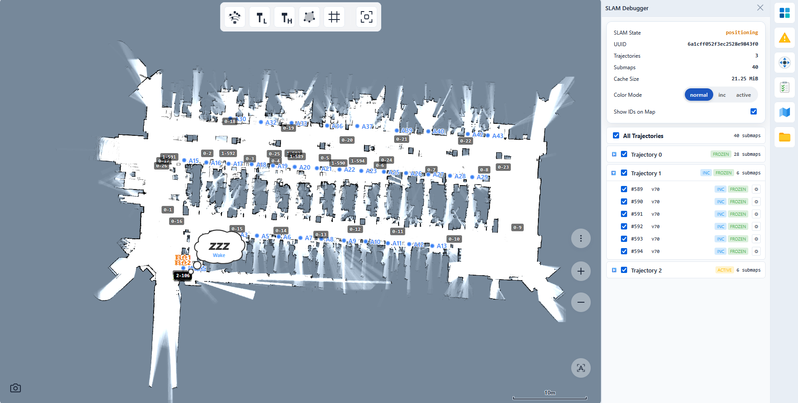
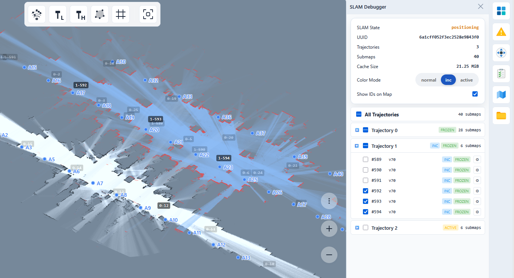

# 子图 (Submaps)



子图渲染是相对于 [`/map_v2` WebSocket 话题](./websocket.md)的一种高级替代方案，用于显示机器人的地图。客户端不是接收单个 PNG 格式的完整地图，而是从许多小的、重叠的 PNG 图像（每个 Cartographer 子图一个）组合成地图。与普通的图像瓦片不同，子图可以重叠且尺寸各异。对于超大型地图（> 2–3 km²），单个全分辨率 PNG 变得不切实际，此时必须采用这种方法。

子图渲染使用两个协同工作的组件：

- WebSocket 话题 `/submap_list` 发布当前的 Cartographer 子图列表，包括位姿、版本和 SLAM 会话 UUID。
- HTTP 接口 `GET /ros/slam/submaps/{uuid}/{trajectory_id}/{submap_index}` 转发 ROS 服务 `/submap_query_v2`，并返回单个子图的二进制 Protobuf 有效负载。

预期的使用流程如下：

1. 订阅 `/submap_list`。
2. 通过 `(uuid, trajectory_id, submap_index, submap_version)` 跟踪每个子图。
3. 当出现新子图或 `submap_version` 发生变化时，获取相应的 `SubmapQueryV2` 有效负载。
4. 解码返回的 Protobuf 并渲染其 `textures`。

这是一个主要的建图接口。WebSocket 话题用于发现和失效机制。HTTP API 提供实际的纹理数据。

## 子图渲染 vs. `/map_v2`

子图渲染是订阅 `/map_v2` WebSocket 话题的替代方案。

**`/map_v2`** 将整个占据网格作为覆盖全图的单个 PNG 发布。它易于实现且有效负载通常较小。然而，当地图增长到大约 2–3 km² 以上时，以全分辨率（通常为 0.05 m/像素）存储在单个图像中变得不切实际 —— 像素数会爆炸。即使降低到 0.1 m/像素也只能暂时缓解问题。

**子图渲染**将地图表示为许多小的、重叠的 PNG —— 每个 Cartographer 子图一个。与均匀的图像瓦片不同，子图可以重叠且尺寸不一。由于每个图像的大小都有界限，它可以扩展到任意大的环境。代价是增加了复杂性：您必须维护每个子图的缓存，处理单个网络请求，并在渲染时合成可能重叠的图像。下载的 PNG 总数增加也会增加内存使用量。

<!-- prettier-ignore -->
| | `/map_v2` (单个 PNG) | 子图渲染 |
| --- | --- | --- |
| 实现复杂度 | 低 | 高 |
| 小型地图的典型负载 | ~100 KB (一次下载) | 总计 ~1 MB (例如 100 个子图 × 每个 10 KB) |
| 支持超大型地图 (> 2–3 km²) | 不支持 | 支持 |
| 内存占用 | 小型地图较低 | 较高 (缓存中有很多图像) |
| 网络流量 | 一次大型下载 | 许多小型下载 |
| 图像布局 | 非重叠 | 重叠、尺寸多变 |

对于典型的室内环境，请选择 `/map_v2`。当您预计地图会超过几平方公里时，请切换到子图渲染。

## `/submap_list` WebSocket 话题

使用正常的 WebSocket 话题接口开启该话题：

```json
{ "enable_topic": "/submap_list" }
```

示例负载：

```json
{
  "topic": "/submap_list",
  "slam_state": "positioning",
  "uuid": "681dc447472ac49d7b074fa1",
  "submap": [
    {
      "trajectory_id": 12,
      "submap_index": 3,
      "submap_version": 42,
      "pose": {
        "x": 1.25,
        "y": -3.5,
        "z": 0,
        "qx": 0,
        "qy": 0,
        "qz": 0.7071,
        "qw": 0.7071
      },
      "is_frozen": true,
      "is_incremental_submap": false,
      "is_nearby_map": false
    }
  ]
}
```

### 字段说明

<!-- prettier-ignore -->
| 字段 | 类型 | 备注 |
| --- | --- | --- |
| `slam_state` | string | `invalid`、`slam` 或 `positioning` 之一。 |
| `uuid` | string | SLAM 会话标识符。这是 HTTP 获取键的一部分。 |
| `submap` | array | 当前子图条目。每个条目是一个 Cartographer 子图。 |

`submap` 中的每个条目包含：

<!-- prettier-ignore -->
| 字段 | 类型 | 备注 |
| --- | --- | --- |
| `trajectory_id` | integer | Cartographer 轨迹 ID。 |
| `submap_index` | integer | 轨迹内的子图索引。 |
| `submap_version` | integer | 递增的内容版本。当此版本变化时重新获取纹理。 |
| `pose.x`, `pose.y`, `pose.z` | number | 世界坐标系下的子图位置。 |
| `pose.qx`, `pose.qy`, `pose.qz`, `pose.qw` | number | 子图朝向四元数。 |
| `is_frozen` | boolean | 子图是否已冻结。 |
| `is_incremental_submap` | boolean | 子图是否属于增量建图输出。 |
| `is_nearby_map` | boolean | 子图是否来自邻近地图源。 |

### 使用提示

- 当 SLAM 会话改变时，`uuid` 会随之改变。请将其视为缓存边界。
- `submap_version` 是纹理有效负载的失效令牌。
- 该话题不包含栅格单元。它仅告知您该获取什么以及如何放置它。

### Slam Debugger（SLAM 调试器）

Slam Debugger 应用以层级视图展示完整的子图列表，按轨迹 ID 分组，并允许逐个开关每个子图的可见性以便检查。



## `SubmapQueryV2` HTTP API

纹理有效负载通过转发的 ROS 服务接口获取：

```text
GET /ros/slam/submaps/{uuid}/{trajectory_id}/{submap_index}?ver={submap_version}
```

示例请求：

```bash
curl \
  -H "Accept: application/x-protobuf" \
  "http://192.168.25.25:8090/ros/slam/submaps/681dc447472ac49d7b074fa1/12/3?ver=42" \
  -o submap_query.pb
```

### 路径参数

<!-- prettier-ignore -->
| 名称 | 类型 | 备注 |
| --- | --- | --- |
| `uuid` | string | 必须与来自 `/submap_list` 的 `uuid` 匹配。 |
| `trajectory_id` | integer | 来自子图条目。 |
| `submap_index` | integer | 来自子图条目。 |

### 查询参数

<!-- prettier-ignore -->
| 名称 | 是否必填 | 备注 |
| --- | --- | --- |
| `ver` | 否 | 缓存行为的版本令牌。正常使用时，请传递 `submap_version`。 |

### 响应

成功的响应返回：

- `200 OK`
- `Content-Type: application/x-protobuf`
- Protobuf 消息类型 `ros_messages.SubmapQueryV2Response`

权威的 Protobuf 定义存在于 SDK 源码中：

- `axbot-ts-sdk/src/proto/submap_query.proto`
- `axbot-ts-sdk/src/proto/geometry.proto`

请以这些文件作为 `ros_messages.SubmapQueryV2Response`、`SubmapTexture` 和 `Pose` 的唯一事实来源。

### 纹理语义

- 一次 HTTP 获取返回该子图版本的所有纹理。
- 大多数使用者将 `textures` 视为按切片 ID 索引的切片记录。
- 某些子图可能不包含所有切片。缺少切片应按不存在处理，而不是视为致命错误。
- `cell_format` 的值目前镜像了 Protobuf 定义：
  - `0`: `LOG_ODDS`
  - `1`: `TSDF_DELTA`
  - `2`: `INTENSITY`

### 缓存行为

此接口专为版本感知缓存设计：

- 带 `?ver=...`: `Cache-Control: public, max-age=31536000, immutable`
- 不带 `ver`: `Cache-Control: no-cache` 并带有弱 `ETag`
- 带有匹配的 `If-None-Match`: `304 Not Modified`

在实践中，客户端应将 `submap_version` 作为 `ver` 传递，并按以下方式缓存：

```text
(uuid, trajectory_id, submap_index, submap_version)
```

### 错误响应

<!-- prettier-ignore -->
| 状态 | 含义 |
| --- | --- |
| `400` | 路径参数无效 |
| `404` | ROS 服务报告找不到子图 |
| `500` | 无法序列化 Protobuf 响应 |
| `502` | ROS 服务调用失败 |
| `504` | ROS 服务在超时前不可用 |

`404` 通常被视为针对该特定版本键的可缓存缺失结果。

## 推荐的客户端流程

### 原始 API 流程

1. 打开 WebSocket 话题并开启 `/submap_list`。
2. 对于 `submap` 中的每个条目，将 `(uuid, trajectory_id, submap_index, submap_version)` 与您的缓存对比。
3. 从 `/ros/slam/submaps/...` 获取缺失的版本。
4. 解码 `SubmapQueryV2Response`。
5. 使用来自 `/submap_list` 的子图位姿和 Protobuf 中每个切片的 `slice_pose` 渲染 `textures[*]`。
6. 新纹理提交后，逐出旧的缓存版本。

### SDK 流程

TypeScript SDK 提供了两个抽象级别。

#### `SubmapCache` (推荐)

`SubmapCache<TSlice>` 是一个通用缓存，处理获取去重、404 缓存、重试冷延迟、并发限制和资源生命周期。您需提供一个**适配器**，将原始 `SubmapTexture` 转换为渲染器使用的切片类型，并在逐出时将其销毁。

```ts
import { SubmapCache, type SubmapCacheAdapter } from "@kingsimba/axbot-sdk";
import { submapListEvents } from "@kingsimba/axbot-sdk";
import type { ros_messages } from "@kingsimba/axbot-sdk/proto";

// 示例：将原始单元存储为 Uint8Array 的适配器
const adapter: SubmapCacheAdapter<Uint8Array> = {
  buildSlice(tex: ros_messages.SubmapTexture): Uint8Array | null {
    return tex.cells ? new Uint8Array(tex.cells) : null;
  },
  disposeSlice(_slice: Uint8Array): void {
    // 对于普通缓冲区无需释放操作
  },
};

const cache = new SubmapCache({ adapter });

submapListEvents.on((msg) => {
  cache.setUuid(msg.uuid);
  for (const submap of msg.submap) {
    cache
      .request(msg.uuid, submap.trajectory_id, submap.submap_index, 0, submap.submap_version)
      .then((cells) => {
        if (!cells) return;
        // 渲染单元...
        cache.evictOldVersions(
          msg.uuid,
          submap.trajectory_id,
          submap.submap_index,
          0,
          submap.submap_version,
        );
      });
  }
});

// 当组件/场景销毁时：
cache.dispose();
```

`SubmapCache` 选项：

<!-- prettier-ignore -->
| 选项名 | 默认值 | 备注 |
| --- | --- | --- |
| `adapter` | 必填 | `buildSlice` + `disposeSlice` 回调 |
| `api` | SDK `robotApi` 单例 | 注入自定义对象进行测试 |
| `maxConcurrentFetches` | `4` | 最大并行 HTTP 请求数 |
| `failureCooldownMs` | `3000` | 失败获取后每个子图的重试退避时间 |

#### `RobotApi.getSubmapQueryV2()` (低级接口)

对于一次性获取或自定义缓存策略，可直接调用此方法：

```ts
import { robotApi } from "@kingsimba/axbot-sdk/robotApi";

const result = await robotApi.getSubmapQueryV2(uuid, trajectoryId, submapIndex, version);
if (result) {
  console.log(result.message.textures.length, result.payloadLength);
}
```

针对 HTTP `404` 返回 `null`，针对非 OK 响应抛出异常，如果解码后的 Protobuf 报告非零状态码也会抛出异常。

## 集成说明

- 地图渲染器应将 `/submap_list` 视为活动子图的权威列表。
- 二进制负载不是 JSON。请使用 `Accept: application/x-protobuf` 请求并作为 Protobuf 解码。
- 新的 `uuid` 应使所有先前缓存的子图纹理失效。
- 快速变化的 `/submap_list` 可能在旧的获取完成之前发布新版本，因此带有版本的键非常重要。
- 如果您仅需要当前的静态地图进行定位，请参阅[当前地图与位姿](./current_map_and_pose.md)。子图是用于 SLAM 可视化的实时 Cartographer 切片。
