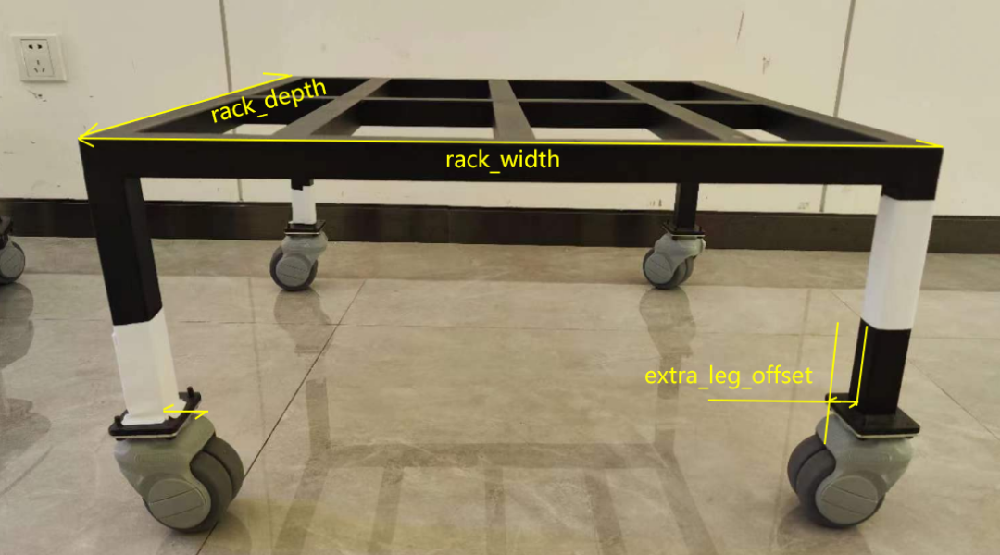
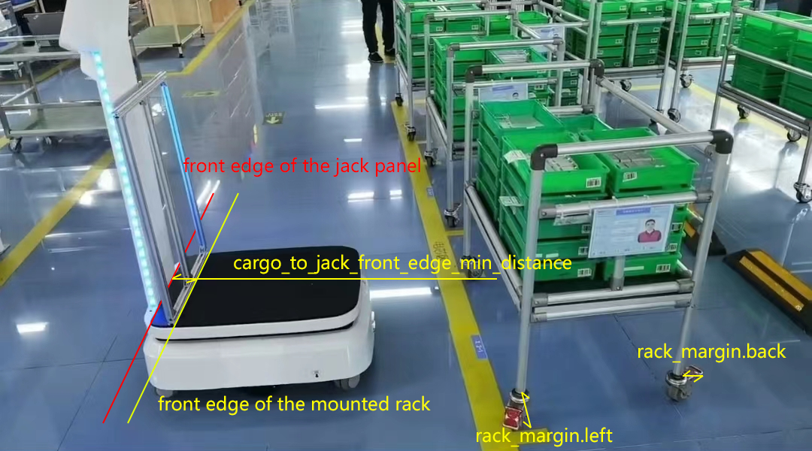

# 系统设置 (System Settings)

自 2.9.0 版本起支持。

系统设置结构如下：

* **schema.json (只读)** - 包含所有设置的元数据，包括名称、类型、范围和描述。
* **default.json (只读)** - 包含所有设置的默认值。
* **user.json** - 存储用户修改的值。
* **effective.json (只读)** - 包含最终生效的值，由 `user.json` 覆盖在 `default.json` 之上生成。

仅 `user.json` 可修改。每当它更新时，`effective.json` 会自动重新计算。

`schema.json` 和 `default.json` 是特定于机器人型号的只读常量。

## 架构 (Schema)

```bash
curl http://192.168.25.25:8090/system/settings/schema
```

```json
{
   "ax":[
      {
         "name":"robot.footprint",
         "title":"机器人：轮廓 (Footprint)",
         "type":"Polygon",
         "default":[
            [
               0.248,
               0.108
            ],
            ["..."],
            [
               0.248,
               -0.108
            ]
         ]
      },
      {
         "name":"control.auto_hold",
         "title":"控制：自动驻车 (Auto Hold)",
         "type":"bool",
         "default":true,
         "description":"空闲时，机器人应保持静止"
      },
      {
         "name":"control.max_forward_velocity",
         "title":"控制：最大前进速度",
         "type":"float",
         "default":1.2,
         "range":"[0, 2.0]"
      },
      {
         "name":"control.max_backward_velocity",
         "title":"控制：最大后退速度",
         "type":"float",
         "default":-0.2,
         "range":"[-0.3, 0]"
      },
      {
         "name":"control.max_forward_acc",
         "title":"控制：最大前进加速度",
         "type":"float",
         "default":0.5,
         "range":"[0, 0.8]"
      },
      {
         "name":"control.max_forward_decel",
         "title":"控制：最大前进减速度",
         "type":"float",
         "default":-2.0,
         "range":"[-2.0, 0]"
      },
      {
         "name":"control.max_angular_velocity",
         "title":"控制：最大角速度",
         "type":"float",
         "default":1.2,
         "range":"[0, 1.2]"
      },
      {
         "name":"control.acc_smoother.smooth_level",
         "title":"控制：加速度平滑级别",
         "type":"Enum",
         "default":"normal",
         "options":[
            "disabled",
            "lower",
            "normal",
            "higher"
         ]
      },
      {
         "name":"bump_based_speed_limit.enable",
         "title":"启用基于颠簸的速度限制",
         "type":"bool",
         "default":true
      },
      {
         "name":"bump_based_speed_limit.bump_tolerance",
         "title":"基于颠簸的速度限制：颠簸公差",
         "type":"float",
         "default":0.5,
         "range":"[0, 1.0]"
      }
   ]
}
```


## 默认设置 (Default Settings)

```bash
curl http://192.168.25.25:8090/system/settings/default
```

## 用户设置 (User Settings)

获取用户设置：

```bash
curl http://192.168.25.25:8090/system/settings/user
```

保存用户设置：

```bash
curl -X POST \
    -H "Content-Type: application/json" \
    -d '...' \
    http://192.168.25.25:8090/system/settings/user
```

部分更新用户设置：

```bash
curl -X PATCH \
    -H "Content-Type: application/json" \
    -d '...' \
    http://192.168.25.25:8090/system/settings/user
```

## 生效设置 (Effective Settings)

```bash
curl http://192.168.25.25:8090/system/settings/effective
```

## 设置选项

本节记录了可用的配置选项。

### rack.specs (货架规格)

定义货架的物理尺寸以及机器人应如何与其交互。

```json
{
   "rack.specs": [
      {
         "width": 0.66,
         "depth": 0.7,

         // 某些货架具有超出轮轴基距的突出部分（如把手）。
         "margin": [0, 0, 0, 0], 

         "alignment": "center",  // center(中心)/back(后部)。 
         "alignment_margin_back": 0.02,

         // 某些货架腿的底板对激光扫描仪不可见。
         // 机器人在货架下方移动时将避开这一额外区域。
         "extra_leg_offset": 0.02, 

         // 自 2.10 版本起：square(方形)/round(圆形)/other(其他)
         "leg_shape": "square", 

         // 自 2.10 版本起：方形腿的边长或圆形腿的直径。
         "leg_size": 0.03, 

         // 自 2.10 版本起。某些货架的脚轮对机器人的激光不可见。
         // 使用此参数可以扩大机器人的轮廓，防止碰撞。
         "foot_radius": 0.05 
      }
   ]
}
```

- `width`, `depth`: 货架尺寸。
- `margin`: 考虑腿部形成的矩形之外的突出部分。
- `extra_leg_offset`: 考虑对 LiDAR 不可见的向内突出的腿。
- `cargo_to_jack_front_edge_min_distance`: 货架挂载时，货架前边缘与顶升面板前边缘之间的距离。




