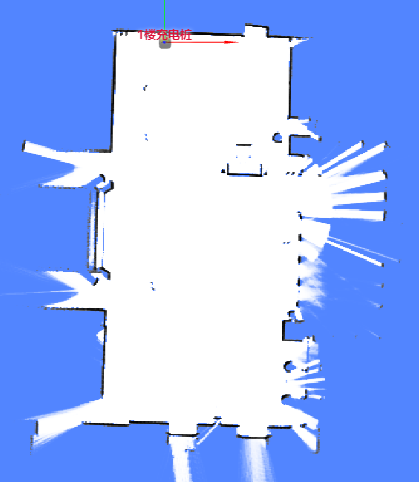
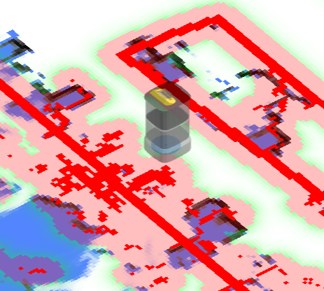
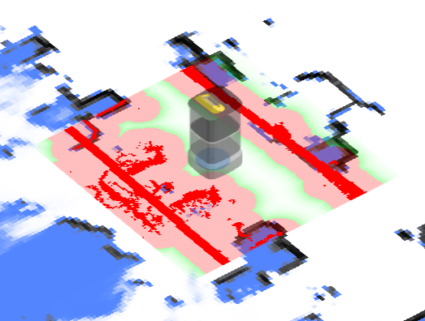
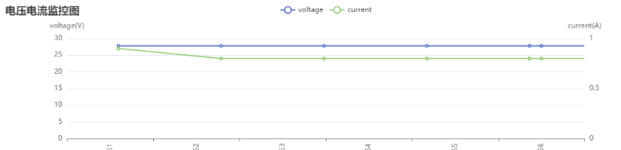
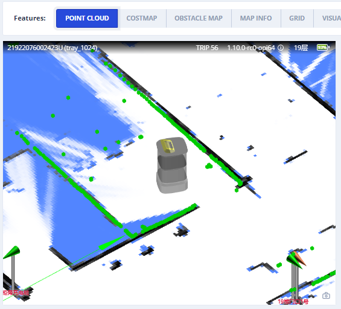
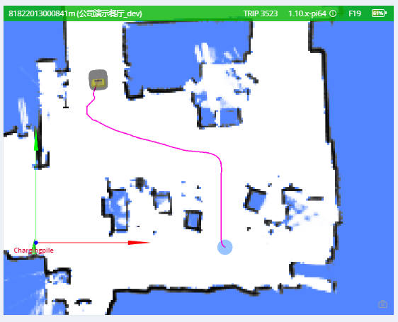
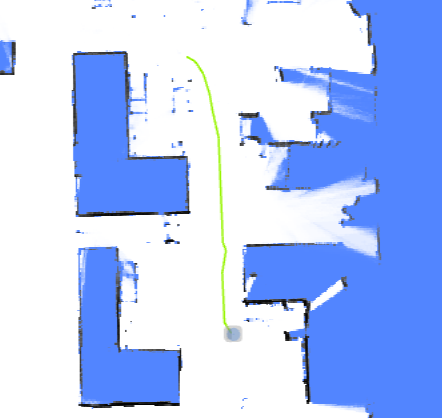
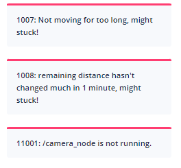

# WebSocket 参考

话题 (Topics) 用于接收来自机器人的实时信息。使用以下命令开启或停止监听特定话题。

```
{"enable_topic": "话题名称"}
{"disable_topic": "话题名称"}
```

自 2.7.0 版本起，支持同时设置多个话题名称。这需要 `supportsEnableTopicList` 功能标志的支持。

```
{"enable_topic": ["/actions", "/alerts", "/tracked_pose"]} // 自 2.7.0 起支持
{"disable_topic": ["/actions", "/alerts", "/tracked_pose"]} // 自 2.7.0 起支持
```

## 地图 (Map)

在纯定位模式下，`/map` 话题包含当前使用的地图，且仅更新一次。

在建图模式下，地图会以较短的固定间隔进行更新。



```json
{
  "topic": "/map",
  "resolution": 0.1, // 单个像素的宽/高，单位为米。
  "size": [182, 59], // 图像尺寸，单位为像素。
  "origin": [-8.1, -4.8], // 左下角像素的世界坐标。
  "data": "iVBORw0KGgoAAAANS..." // Base64 编码的 PNG 文件。
}
```

## 障碍物地图 (Obstacle Map)

这显示了机器人周围检测到的障碍物，包括来自所有传感器的数据以及虚拟墙。

其主要用于调试，提供了机器人视角下的传感器观测。

深红色像素代表实际的障碍物，而浅红色像素是基于机器人的内切半径扩展的。机器人的中心不应进入红色区域；否则表示发生了碰撞。

| 低分辨率代价地图 (Low Res. Costmap) | 高分辨率代价地图 (High Res. Costmap) |
| -------------------------- | ---------------------------- |
| /maps/5cm/1hz              | /maps/1cm/1hz                |
| 用于路径规划。    | 用于碰撞检测。 |
|  |   |

```
{
  "topic": "/maps/5cm/1hz", // 或 '/maps/1cm/1hz'
  "resolution": 0.05,
  "size": [
    200,
    200
  ],
  "origin": [
    -2.8,
    -6.2
  ],
  "data": "iVBORw0KGgoAAAANS..." // Base64 编码的 PNG 文件。
}
```

## 车轮状态 (Wheel State)

```json
{
  "topic": "/wheel_state",
  "control_mode": "auto", // auto/remote/manual (自动/远程/手动)
  "emergency_stop_pressed": true, // 是否处于急停模式。

  // 可选。仅部分机器人型号支持。
  // 某些轮子具有释放线束。
  // 此标志反映了线束是否激活。
  "wheels_released": true
}
```

## 定位状态 (Positioning State)

```json
{
  "topic": "/slam/state",
  
  // inactive: 空闲。未在创建地图，且未设置地图。
  // slam: 正在创建地图。
  // positioning: 已设置地图，机器人处于定位状态。
  "state": "positioning",

  "nav_sat_state": "no_fix", // 自 3.14 起支持。no_fix, sat_base 或 rtk_fixed

  "reliable": true,       // false 表示定位丢失。

  // "lidar_reliable = False" 表示新创建的观测值（子图）与当前静态地图之间不存在约束。
  // 
  // 定位丢失的步骤如下：
  // 1. 不存在约束（新观测与静态地图之间）；"lidar_reliable" 变为 false。
  // 2. 机器人进入纯航位推算模式，"position_loss_progress" 开始增加。
  // 3. 移动一段时间后，如果创建了新约束，"lidar_reliable" 变为 true。
  //    然而，如果 "position_loss_progress" 达到 1.0，"reliable" 也会变为 false。
  "lidar_reliable": false, // 自 2.11.0-rc18 起支持
  "position_loss_progress": 0.35,  // 自 2.11.0-rc18 起支持。仅当 lidar_reliable = false 时存在。

  // 定位质量（实验性功能）。
  //
  // 仅在定位状态下有效。
  // 自 2.3.0 起支持。
  //  0 - 未知
  //  1 - 丢失
  //  3 - 差
  //  8 - 良好
  // 10 - 极佳
  "position_quality": 10,
  
  // 当前 LiDAR 点云与静态地图的匹配程度。
  "lidar_matching_score": 0.545, 

  // 其他调试标志。
  "lidar_matched": true,
  "wheel_slipping": false,
  "inter_constraint_count": 27,
  "good_constraint_count": 27
}
```

## 视觉检测对象 (Vision Detected Objects)

::: warning 警告
实验性功能
:::

```ts
enum VisualObjectLabel {
  none = 0,
  person = 1, // 人
  platformHandTruck = 2, // 平台手推车
  scaffold = 3, // 脚手架
  queueStand = 4, // 排队护栏
  portableGrandstand = 5, // 便携式看台
}
```

```json
{
  "topic": "/vision_detected_objects",
  "boxes": [
    {
      "pose": { "pos": [0.32, 0.97], "ori": 0.0 }, // 对象位置和朝向。
      "dimensions": [0.0, 0.0, 0.0], // 对象的宽、长、高。
      "value": 0.8005573153495789,
      "label": 1 // VisualObjectLabel
    },
    {
      "pose": { "pos": [0.63, 1.08], "ori": 0.0 },
      "dimensions": [0.0, 0.0, 0.0],
      "value": 0.5348057150840759,
      "label": 1
    },
    {
      "pose": { "pos": [0.51, 0.74], "ori": 0.0 },
      "dimensions": [0.0, 0.0, 0.0],
      "value": 0.41888049244880676,
      "label": 1
    }
  ]
}
```

## 电池状态 (Battery State)



```json
{
  "topic": "/battery_state",
  "secs": 1653299708, // 时间戳。
  "voltage": 26.3, // 电池电压。
  "current": 3.6, // 电池电流。通常充电时为负，运行时为正。
  "percentage": 0.64, // 电池百分比。
  "power_supply_status": "discharging" // charging/discharging/full (充电/放电/充满)。
}
```

## 详细电池状态 (Detailed Battery State)

自 2.11.0 起支持


```json
{
  "topic": "/detailed_battery_state",
  "secs": 1653299708, // 时间戳。
  "voltage": 26.3, // 电池电压。
  "current": 3.6, // 电池电流。通常充电时为负，运行时为正。
  "percentage": 0.64, // 电池百分比。
  "power_supply_status": "discharging", // charging/discharging/full。
  "cell_voltages": [4.141, 4.138, 4.139, 4.133, 4.136, 4.138, 4.138],
  "capacity": 14.0, // Ah
  "design_capacity": 15.0, // Ah
  "state_of_health": 0.93, // 百分比。
  "cycle_count": 80,
}
```

## 当前位姿 (Current Pose)

世界坐标系下的当前位姿。

```json
{
  "topic": "/tracked_pose",
  "pos": [3.7325, -10.8525],
  "ori": -1.56 // 朝向。正 X 轴为 0，正 Y 轴为 pi/2。
}
```

## 规划状态 (Planning State)

返回最近一次移动任务的执行状态。

```ts
enum ActionType {
  none,
  standard,
  charge, // 充电
  along_given_route, // 沿指定轨迹移动。
  return_to_elevator_waiting_point, // 进入电梯失败时使用。
  enter_elevator, // 进入电梯
  leave_elevator, // 离开电梯
  pull_over, // (请勿使用) 靠边停车以为其他机器人让路。
  align_with_rack, // (请勿使用)
}

enum MoveState {
  none,
  idle, // 空闲
  moving, // 移动中
  succeeded, // 成功
  failed, // 失败
  cancelled, // 已取消
}

enum StuckState {
  move_stucked, // 移动受阻
  target_spin_stucked, // 目标旋转受阻
}
```

```json
{
  "topic": "/planning_state",

  "map_uid": "xxxxxx", // 当前地图的 UID。

  // 动作
  "action_id": 3354,
  "action_type": "enter_elevator", // 见 ActionType (自 2.5.2 起)。
  "move_state": "moving", // 见 MoveState。
  "fail_reason": 0, // 当 move_state == failed 时有效。
  "fail_reason_str": "none", // 当 move_state == failed 时有效。
  "remaining_distance": 2.8750057220458984, // 单位：米。

  // 目标相关
  "target_poses": [
    {
      "pos": [4.08, 2.99],
      "ori": 0
    }
  ],

  // 意图相关
  "move_intent": "", // 已被 `action_type` 废弃。
  "intent_target_pose": {
    // 当前目标的位姿。
    "pos": [0, 0],
    "ori": 0
  },

  // 受阻状态
  "stuck_state": "move_stucked", // 见 StuckState (自 2.5.2 起)。
  "in_elevator": true, // 可选 (自 2.5.2 起)。
  "viewport_blocked": true, // 可选 (自 2.5.2 起)。

  // 可选 (自 2.9.0 起)。
  // 目的地已被其他机器人占用，因此在路边等待。
  "is_waiting_for_dest": true,

  "docking_with_conveyer": true, // 可选 (自 2.9.0 起)。

  // 可选 (自 2.11.0 起)。默认为 0。
  // 仅在沿指定路线移动时有效。
  // 表示已经通过的点数。
  "given_route_passed_point_count": 3 
}
```

## LiDAR 点云 (LiDAR Point Cloud)



### 用于 SLAM 的点云

用于 SLAM 的一个或多个 LiDAR 设备（如果有）的组合点云。坐标在世界坐标系下。

```json
{
  "topic": "/scan_matched_points2",
  "stamp": 1653302201889,
  "points": [
    [7.83, 3.84, 0.04],
    [7.8, 3.88, 0.04],
    [7.79, 4.14, 0.04]
    ...
  ]
}
```

### 单个 LiDAR 设备的点云

自 2.12.0 起支持

该话题用于调试单个 LiDAR 设备。坐标在世界坐标系下。

常见的话题名称包括：

```
/horizontal_laser_2d/matched
/left_laser_2d/matched
/right_laser_2d/matched
/lt_laser_2d/matched (左顶)
/rb_laser_2d/matched (右后)
```

```json
{
    "topic": "/horizontal_laser_2d/matched",
    "stamp": 1741764468.939,
    "fields": [
        {
            "name": "x",
            "data_type": "f32"
        },
        {
            "name": "y",
            "data_type": "f32"
        },
        {
            "name": "z",
            "data_type": "f32"
        },
        {
            "name": "intensity",
            "data_type": "f32"
        }
    ],
    "data": "QphAQHPLmkHDpvk/xcTEPk+RQED22ppBp6..." // Base64 编码的二进制数据。
}
```

## 全局路径 (Global Path)

当前的全局路径。



```json
{
  "topic": "/path",
  "stamp": 1653301966860,
  "positions": [
    [0.94, 0.27, 0.01], // 航向角（第 3 个数）在 2.12.0 版本中加入。
    [0.94, 0.25, 0.01],
    [0.96, 0.25, 0.01]
  ]
}
```

## 轨迹 (Trajectory)

机器人的行走轨迹。

- 在建图模式下，轨迹代表整个建图过程的完整路径。
- 在纯定位模式下，轨迹会定期裁剪。



:::warning 警告
对于 2.5.0 或更低版本，开启消息被错误地命名为 `/trajectory_node_list`。
为了保险起见，请同时开启 `/trajectory` 和 `/trajectory_node_list`。
:::

```json
{
  "topic": "/trajectory",
  "points": [
    [2.0, 3.0],
    [2.1, 3.1],
    [2.4, 3.0],
    [2.7, 2.9],
    [3.0, 2.8],
    [3.6, 2.6],
    [3.7, 2.5],
    [3.9, 2.3],
    [4.1, 2.1],
    [3.9, -1.1],
    [3.8, -2.2]
  ]
}
```

## 告警 (Alerts)

该话题包含当前处于活动状态的告警。

应用程序应通过监听告警并采取相应措施，例如：

1.  当电量低 (8501) 时返回充电器，或在电量极低 (8003) 时关闭机器人。
2.  向用户发出对接错误 (10001, 10002, 10003) 的警告。
3.  向用户发出机器人可能翻倒 (4008) 的警告。
4.  在创建新地图前，向用户发出 IMU 校准错误 (4501, 4502) 的警告。
5.  通知我们应用程序崩溃 (1001, 1002, 1003, 1004, 2001, 3001, 4001, 11001 等)。
6.  通知我们传感器错误 (4009, 5001 等)。

告警的完整列表可在[此 URL](https://rb-admin.autoxing.com/api/v1/static/error_code_map_full.json) 找到。



```json
{
  "topic": "/alerts",
  "alerts": [
    {
      "code": 6004,
      "level": "error",
      "msg": "Kernel temperature is higher than 80!"
    }
  ]
}
```

## 行驶距离 (Traveled Distance)

::: warning 警告
实验性功能
:::

```json
{
  "topic": "/platform_monitor/travelled_distance",
  "start_time": 1653303520, // 当前移动的开始时间。
  "duration": 60, // 当前移动的执行时间。
  "distance": 27.89, // 当前移动期间行驶的距离。
  "accumulated_distance": 5230.0 // 自系统启动以来行驶的总距离。
}
```

## RGB 视频流

H.264 编码的数据流。

```json
{
  "topic": "/rgb_cameras/front/video",
  "stamp": 1653303702.821,
  "data": "AAAAAWHCYADAAb5Bv4yqqseHIsjRwL5E4C4uX/CmRcXVaxddV3zf5uZO..."
}
```


::: tip 提示
对于浏览器或 Node.js，可以使用 [jmuxer](https://github.com/samirkumardas/jmuxer) 对该流进行解码。
使用 `flushingTime: 0` 以最小化延迟。

```js
this.jmuxer = new JMuxer({
    node: myNativeElement,
    mode: 'video',
    flushingTime: 0,
});
```
:::

当前话题（可能因设备而异）：

- `/rgb_cameras/front/video`
- `/rgb_cameras/back/video`
- `/rgb_cameras/front_augmented/video`: 用于调试基于视觉的对象检测的增强型视频流。


## RGB 图像流

JPEG 编码的图像流。
