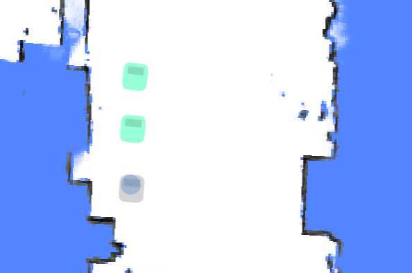
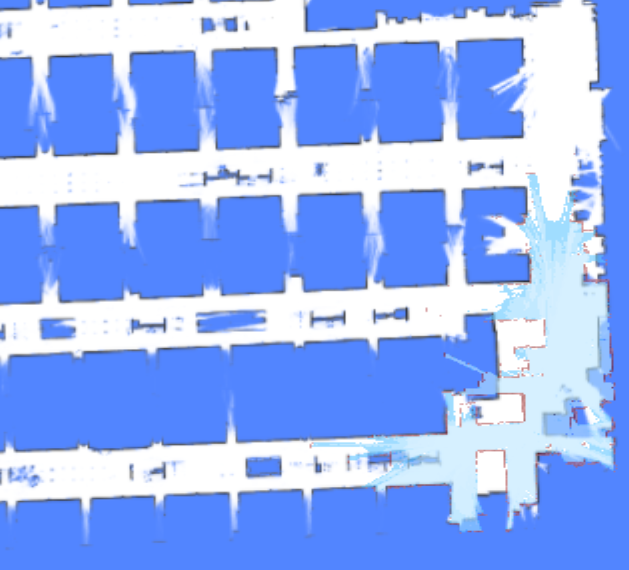
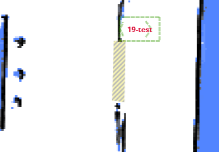
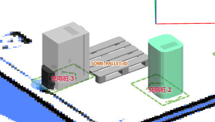
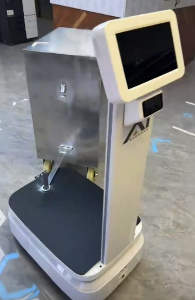
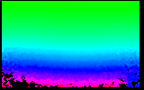
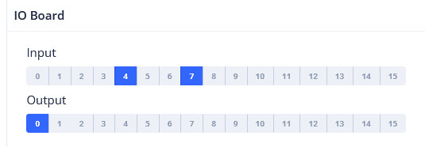

# WebSocket 参考 (WebSocket Reference) {#websocket-reference}

Topic 用于接收机器人的实时信息。
使用以下命令开始或停止监听特定的 Topic。

```
{"enable_topic": "TOPIC_NAME"}
{"disable_topic": "TOPIC_NAME"}
```

自 2.7.0 版本起，支持同时启用多个 Topic。这需要 `supportsEnableTopicList` 能力标志。

```
{"enable_topic": ["/actions", "/alerts", "/tracked_pose"]} // 自 2.7.0 起
{"disable_topic": ["/actions", "/alerts", "/tracked_pose"]} // 自 2.7.0 起
```

## 地图 (Map) {#map}

在纯定位模式下，`/map` Topic 包含当前使用的地图，且仅更新一次。

在建图模式下，地图会以较短的固定间隔更新。


```json
{
  "topic": "/map",
  "resolution": 0.1, // 单个像素的宽/高，单位：米。
  "size": [182, 59], // 图像尺寸，单位：像素。
  "origin": [-8.1, -4.8], // 左下角像素的世界坐标。
  "data": "iVBORw0KGgoAAAANSUhEUgAAALYAAAA7BAAAAA..." // Base64 编码的 PNG 文件。
}
```

## 障碍物地图 (Obstacle Map) {#obstacle-map}

显示机器人周围检测到的障碍物，包括来自所有传感器的数据和虚拟墙。

此功能主要用于调试，通过机器人的传感器视角提供观察。

深红色像素代表实际障碍物，而浅红色像素是根据机器人的内切圆半径扩充的。机器人的中心永远不应进入红色区域；否则表示发生了碰撞。

<!-- prettier-ignore -->
| 低分辨率代价地图 (Low Res. Costmap) | 高分辨率代价地图 (High Res. Costmap) |
| -------------------------- | ---------------------------- |
| /maps/5cm/1hz              | /maps/1cm/1hz                |
| 用于路径规划。               | 用于碰撞检测。                |
|  |   |

```
{
  "topic": "/maps/5cm/1hz", // 或 '/maps/1cm/1hz'
  "resolution": 0.05,
  "size": [
    200,
    200
  ],
  "origin": [
    -2.8,
    -6.2
  ],
  "data": "iVBORw0KGgoAAAANSUhEUgAAAMgAAADICA..." // Base64 编码的 PNG 文件。
}
```

## 车轮状态 (Wheel State) {#wheel-state}

```json
{
  "topic": "/wheel_state",
  "control_mode": "auto", // auto/remote/manual (自动/远程/手动)
  "emergency_stop_pressed": true, // 是否处于急停模式。

  // 可选。仅由特定机器人型号支持。
  // 某些车轮带有释放轮子的连线。
  // 此标志反映该连线是否处于激活状态。
  "wheels_released": true
}
```

## 定位状态 (Positioning State) {#positioning-state}

```json
{
  "topic": "/slam/state",

  // inactive: 空闲。未在建图，且未设置地图。
  // slam: 正在建图。
  // positioning: 已设置地图，机器人处于定位状态。
  "state": "positioning",

  "nav_sat_state": "no_fix", // 自 3.14 起。no_fix, sat_base 或 rtk_fixed

  "reliable": true, // false 表示位置丢失。

  // "lidar_reliable = False" 表示新创建的观测值（子图）与当前静态地图之间不存在约束。
  //
  // 位置丢失的步骤如下：
  // 1. 不存在约束（在新观测值与静态地图之间）；"lidar_reliable" 变为 false。
  // 2. 机器人进入纯死推（Dead-reckoning）模式，"position_loss_progress" 开始增加。
  // 3. 移动一段距离后，如果创建了新约束，"lidar_reliable" 变为 true。
  //    然而，如果 "position_loss_progress" 达到 1.0，"reliable" 也会变为 false。
  "lidar_reliable": false, // 自 2.11.0-rc18 起
  "position_loss_progress": 0.35, // 自 2.11.0-rc18 起。仅在 lidar_reliable = false 时存在。

  // 定位质量（实验性）。
  //
  // 仅在定位状态下有效。
  // 自 2.3.0 起。
  //  0 - 未知 (unknown)
  //  1 - 丢失 (lost)
  //  3 - 差 (poor)
  //  8 - 好 (good)
  // 10 - 极好 (excellent)
  "position_quality": 10,

  // 当前激光雷达点云与静态地图的匹配程度。
  "lidar_matching_score": 0.545,

  // 其他调试标志。
  "lidar_matched": true,
  "wheel_slipping": false,
  "inter_constraint_count": 27,
  "good_constraint_count": 27
}
```

## 视觉检测对象 (Vision Detected Objects) {#vision-detected-objects}

::: warning
实验性功能
:::

```ts
enum VisualObjectLabel {
  none = 0,
  person = 1, // 人
  platformHandTruck = 2, // 平台手推车
  scaffold = 3, // 脚手架
  queueStand = 4, // 排队隔离带
  portableGrandstand = 5, // 便携式看台
}
```

```json
{
  "topic": "/vision_detected_objects",
  "boxes": [
    {
      "pose": { "pos": [0.32, 0.97], "ori": 0.0 }, // 物体的位置和朝向。
      "dimensions": [0.0, 0.0, 0.0], // 物体的宽、长、高。
      "value": 0.8005573153495789,
      "label": 1 // VisualObjectLabel
    },
    {
      "pose": { "pos": [0.63, 1.08], "ori": 0.0 },
      "dimensions": [0.0, 0.0, 0.0],
      "value": 0.5348057150840759,
      "label": 1
    },
    {
      "pose": { "pos": [0.51, 0.74], "ori": 0.0 },
      "dimensions": [0.0, 0.0, 0.0],
      "value": 0.41888049244880676,
      "label": 1
    }
  ]
}
```

## 电池状态 (Battery State) {#battery-state}


```json
{
  "topic": "/battery_state",
  "secs": 1653299708, // 时间戳。
  "voltage": 26.3, // 电池电压。
  "current": 3.6, // 电池电流。通常充电时为负，运行时为正。
  "percentage": 0.64, // 电池百分比。
  "power_supply_status": "discharging" // charging/discharging/full (充电/放电/充满)。
}
```

## 详细电池状态 (Detailed Battery State) {#detailed-battery-state}

自 2.11.0 起


```json
{
  "topic": "/detailed_battery_state",
  "secs": 1653299708, // 时间戳。
  "voltage": 26.3, // 电池电压。
  "current": 3.6, // 电池电流。通常充电时为负，运行时为正。
  "percentage": 0.64, // 电池百分比。
  "power_supply_status": "discharging", // charging/discharging/full。
  "cell_voltages": [4.141, 4.138, 4.139, 4.133, 4.136, 4.138, 4.138],
  "capacity": 14.0, // Ah
  "design_capacity": 15.0, // Ah
  "state_of_health": 0.93, // 百分比。
  "cycle_count": 80
}
```

## 当前位姿 (Current Pose) {#current-pose}

世界坐标系下的当前位姿。

```json
{
  "topic": "/tracked_pose",
  "pos": [3.7325, -10.8525],
  "ori": -1.56 // 朝向。正 X 轴为 0，正 Y 轴为 pi/2。
}
```

## 规划状态 (Planning State) {#planning-state}

返回最近一次移动动作的执行状态。

```ts
enum ActionType {
  none,
  standard,
  charge, // 充电
  along_given_route, // 沿指定轨迹移动。
  return_to_elevator_waiting_point, // 用于进入电梯失败时。
  enter_elevator, // 进入电梯
  leave_elevator, // 离开电梯
  pull_over, // (不建议使用) 靠边停车以避让其他机器人。
  align_with_rack, // (不建议使用)
}

enum MoveState {
  none,
  idle, // 空闲
  moving, // 移动中
  succeeded, // 成功
  failed, // 失败
  cancelled, // 已取消
}

enum StuckState {
  move_stucked, // 移动受阻
  target_spin_stucked, // 目标旋转受阻
}
```

```json
{
  "topic": "/planning_state",

  "map_uid": "xxxxxx", // 当前地图的 UID。

  // action (动作)
  "action_id": 3354,
  "action_type": "enter_elevator", // 见 ActionType (自 2.5.2 起)。
  "move_state": "moving", // 见 MoveState。
  "fail_reason": 0, // 当 move_state == failed 时有效。
  "fail_reason_str": "none", // 当 move_state == failed 时有效。
  "remaining_distance": 2.8750057220458984, // 单位：米。

  // 目标相关
  "target_poses": [
    {
      "pos": [4.08, 2.99],
      "ori": 0
    }
  ],

  // 意图相关
  "move_intent": "", // 已被 `action_type` 废弃。
  "intent_target_pose": {
    // 当前目标的位姿。
    "pos": [0, 0],
    "ori": 0
  },

  // 受阻状态
  "stuck_state": "move_stucked", // 见 StuckState (自 2.5.2 起)。
  "in_elevator": true, // 可选 (自 2.5.2 起)。
  "viewport_blocked": true, // 可选 (自 2.5.2 起)。

  // 可选 (自 2.9.0 起)。
  // 目的地被其他机器人占用，因此在路边等待。
  "is_waiting_for_dest": true,

  "docking_with_conveyer": true, // 可选 (自 2.9.0 起)。

  // 可选 (自 2.11.0 起)。默认为 0。
  // 仅在沿指定路线移动时有效。
  // 表示已经通过的点数量。
  "given_route_passed_point_count": 3
}
```

## 激光雷达点云 (LiDAR Point Cloud) {#lidar-point-cloud}


### 用于 SLAM 的点云 (Point Cloud Used for SLAM) {#point-cloud-used-for-slam}

来自一个或多个用于 SLAM 的激光雷达设备（如果有）的组合点云。
坐标位于世界坐标系中。

```json
{
  "topic": "/scan_matched_points2",
  "stamp": 1653302201889,
  "points": [
    [7.83, 3.84, 0.04],
    [7.8, 3.88, 0.04],
    [7.79, 4.14, 0.04]
    ...
  ]
}
```

### 单个激光雷达设备的点云 (Point Cloud for Individual LiDAR Devices) {#point-cloud-for-individual-lidar-devices}

自 2.12.0 起

此 Topic 用于调试单个激光雷达设备。
坐标位于世界坐标系中。

常用的 Topic 名称 include：

```
/horizontal_laser_2d/matched
/left_laser_2d/matched
/right_laser_2d/matched
/lt_laser_2d/matched (左前上)
/rb_laser_2d/matched (右后下)
```

```json
{
  "topic": "/horizontal_laser_2d/matched",
  "stamp": 1741764468.939,
  "fields": [
    {
      "name": "x",
      "data_type": "f32"
    },
    {
      "name": "y",
      "data_type": "f32"
    },
    {
      "name": "z",
      "data_type": "f32"
    },
    {
      "name": "intensity",
      "data_type": "f32"
    }
  ],
  "data": "QphAQHPLmkHDpvk/xcTEPk+RQED22ppBp6..." // Base64 编码的二进制数据。
}
```

## 全局路径 (Global Path) {#global-path}

当前全局路径。


```json
{
  "topic": "/path",
  "stamp": 1653301966860,
  "positions": [
    [0.94, 0.27, 0.01], // 航向角（第 3 个成员）在 2.12.0 版本中添加。
    [0.94, 0.25, 0.01],
    [0.96, 0.25, 0.01]
  ]
}
```

## 轨迹 (Trajectory) {#trajectory}

机器人的行驶轨迹。

- 在建图模式下，轨迹代表整个建图过程的完整路径。
- 在纯定位模式下，轨迹会定期被修剪。


:::warning
对于 2.5.0 或更低版本，此启用消息被错误地命名为 `/trajectory_node_list`。
为保险起见，请同时启用 `/trajectory` 和 `/trajectory_node_list`。
:::

```json
{
  "topic": "/trajectory",
  "points": [
    [2.0, 3.0],
    [2.1, 3.1],
    [2.4, 3.0],
    [2.7, 2.9],
    [3.0, 2.8],
    [3.6, 2.6],
    [3.7, 2.5],
    [3.9, 2.3],
    [4.1, 2.1],
    [3.9, -1.1],
    [3.8, -2.2]
  ]
}
```

## 报警 (Alerts) {#alerts}

此 Topic 包含当前处于激活状态的报警。

应用程序应监控报警并采取适当措施，例如：

1.  当电量低时返回充电桩 (8501)，或在电量极低时关闭机器人 (8003)。
2.  向用户发出对接错误警告 (10001, 10002, 10003)。
3.  向用户发出潜在的机器人倾翻警告 (4008)。
4.  在创建新地图前，向用户发出 IMU 校准错误警告 (4501, 4502)。
5.  通知我们应用程序崩溃 (1001, 1002, 1003, 1004, 2001, 3001, 4001, 11001 等)。
6.  通知我们传感器错误 (4009, 5001 等)。

报警的完整列表可在[此 URL](https://rb-admin.autoxing.com/api/v1/static/error_code_map_full.json) 找到。


```json
{
  "topic": "/alerts",
  "alerts": [
    {
      "code": 6004,
      "level": "error",
      "msg": "Kernel temperature is higher than 80!"
    }
  ]
}
```

## 行驶距离 (Traveled Distance) {#traveled-distance}

::: warning
实验性功能
:::

```json
{
  "topic": "/platform_monitor/travelled_distance",
  "start_time": 1653303520, // 当前移动的开始时间。
  "duration": 60, // 当前移动的执行时间。
  "distance": 27.89, // 当前移动过程中行驶的距离。
  "accumulated_distance": 5230.0 // 自系统启动以来的总行驶距离。
}
```

## RGB 视频流 (RGB Video Stream) {#rgb-video-stream}

H.264 编码的数据流。

```json
{
  "topic": "/rgb_cameras/front/video",
  "stamp": 1653303702.821,
  "data": "AAAAAWHCYADAAb5Bv4yqqseHIsjRwL5E4C4uX/CmRcXVaxddV3zf5uZO..."
}
```


::: tip
对于浏览器或 Node.js，可以使用 [jmuxer](https://github.com/samirkumardas/jmuxer) 解码该流。
使用 `flushingTime: 0` 以最小化延迟。

```js
this.jmuxer = new JMuxer({
  node: myNativeElement,
  mode: "video",
  flushingTime: 0,
});
```

:::

当前 Topic（可能因设备而异）：

- `/rgb_cameras/front/video`
- `/rgb_cameras/back/video`
- `/rgb_cameras/front_augmented/video`: 用于调试基于视觉的对象检测的增强视频流。


## RGB 图像流 (RGB Image Stream) {#rgb-image-stream}

JPEG 编码的图像流。

::: tip
图像流比 H264 视频流大得多。对于互联网传输，请使用视频流。
:::

```json
{
  "topic": "/rgb_cameras/front/compressed",
  "stamp": 1653303702.821,
  "format": "jpeg",
  "data": "YXNkZmFzZndlcndldHNhZGZhc2Rmd2V0cjJ5NDVqdHltNDU2..."
}
```

当前 Topic：（不同设备可能有所不同）

- `/rgb_cameras/front/compressed`
- `/rgb_cameras/back/compressed`

## 传感器管理状态 (Sensor Manager State) {#sensor-manager-state}

```ts
type PowerState =
  | "awake" // 正常运行
  | "awakening" // 正在从睡眠恢复到唤醒。通常持续 2-3 秒。
  | "sleeping"; // 睡眠时，部分传感器会关闭。
```

```json
{
  "topic": "/sensor_manager_state",
  "power_state": "awake" // 见 PowerState
}
```

## 机器人模型 (Robot Model) {#robot-model}

机器人的轮廓（footprint）可能会动态变化。例如，加载货架后轮廓会变大。
此 Topic 用于获取机器人的动态轮廓。

```json
{
  "topic": "/robot_model",
  "footprint": [
    [0.13, -0.25],
    [0.203, -0.228],
    [0.235, -0.178],
    [0.245, -0.077],
    [0.248, 0.029],
    [0.243, 0.163],
    [0.235, 0.217],
    [0.207, 0.26],
    [0.17, 0.291],
    [0.122, 0.324],
    [-0.122, 0.324],
    [-0.17, 0.291],
    [-0.207, 0.26],
    [-0.235, 0.217],
    [-0.243, 0.163],
    [-0.248, 0.029],
    [-0.245, -0.077],
    [-0.235, -0.178],
    [-0.203, -0.228],
    [-0.13, -0.25]
  ],
  // 自 2.12.4 起，expanded_footprint 在机器人周围增加了更多安全区域
  "expanded_footprint": [
    [-0.245, -0.077],
    [-0.235, -0.178],
    [-0.203, -0.228],
    [-0.13, -0.25]
    "..."
  ]
  "width": 0.496
}
```

## 附近机器人 (Nearby Robots) {#nearby-robots}

配备专用硬件（可选安装）后，机器人可以感知其他机器人的位置和路径。

此信息可用于避免机器人之间的碰撞或进行编队移动。



```json
{
  "topic": "/nearby_robots",
  "robots": [
    {
      "uid": "21922076002353N",
      "pose": { "pos": [1.05, 0.08], "ori": 1.69 },
      "trend": [],
      "footprint_digest": "0150acd9" // 自 2.7.0 起，见 /nearby_robot_footprints
    },
    {
      "uid": "21922076002413T",
      "pose": { "pos": [0.19, 0.01], "ori": 1.6 },
      "trend": [
        [0.19, 0.01],
        [0.12, -0.02]
      ],
      "footprint_digest": "7cb254d5"
    }
  ]
}
```

## 附近机器人轮廓 (Nearby Robot Footprints) {#nearby-robot-footprints}

此 Topic 包含附近机器人的详细轮廓。

在 2.7.0 中，Topic `/nearby_robots` 增加了 `footprint_digest` 属性。
它可以与 `/nearby_robot_footprints` 结合使用，以确定附近机器人的轮廓。

```json
{
  "topic": "/nearby_robot_footprints",
  "footprints": [
    {
      "digest": "0150acd9",
      "coordinates": [
        [0.0, -0.273],
        [0.14, -0.27],
        [0.2, -0.25],
        [0.24, -0.2],
        [0.25, -0.1],
        [0.25, 0.13],
        [0.24, 0.2],
        [0.18, 0.26],
        [0.15, 0.265],
        [0.14, 0.283],
        [-0.14, 0.283],
        [-0.15, 0.265],
        [-0.18, 0.26],
        [-0.24, 0.2],
        [-0.25, 0.13],
        [-0.25, -0.1],
        [-0.24, -0.2],
        [-0.2, -0.25],
        [-0.14, -0.27]
      ]
    }
  ]
}
```

## 里程计状态 (Odom State) {#odom-state}

一个调试 Topic，用于可视化激光里程计的协方差。

```json
{
  "topic": "/odom_state",
  "lidar_odom_reliable": true,
  "lidar_odom_cov": [
    0.000023889469957794063, -0.00002311983917024918, -0.00002311983917024918,
    0.00005866867650183849
  ]
}
```

## 融合传感器状态 (Fused Sensor State) {#fused-sensor-state}

```json
{
  "topic": "/fused_sensor_state",
  "slipping": false,
  "major_slipping": false,
  "pushed": false,
  "accelerability": 1,
  "suggested_speed": 0.5,
  "is_still": true, // 同时满足 odom_still 和 imu_still
  "odom_still": true, // 轮速计读数为 0 或接近 0
  "imu_still": true // 最近 N 秒内 gyro 各轴积分均低于阈值
}
```

## IMU 状态 (IMU State) {#imu-state}

来自 IMU 传感器的原始惯性数据。

```json
{
  "topic": "/imu_state",
  "calibrate_state": 0,
  "calibrate_fail_reason": 0,
  "temperature": 62.4,
  "angular_velocity_standard_deviation_10s": [0.02175, 0.02393, 0.02442],
  "angular_velocity_avg_10s": [0.00021, 0.00191, -0.00253],
  "linear_acc_standard_deviation_10s": [0.00517, 0.00535, 0.00575],
  "gyro_calibrating": true,

  "gyro_bias": [0.00123, 0.00235, 0.00346], // 当前偏差

  // 当 gyro_calibrating 为 true 时，
  // gyro_bias 将缓慢向此值靠近
  "gyro_bias_target": [0.00457, 0.00568, 0.00679]
}
```

## 外部 RGB 摄像头数据 (External RGB Camera Data) {#external-rgb-camera-data}

如果机器人没有内置 RGB 摄像头，可以安装外部摄像头将数据回传给机器人。这使得监控和基于视觉的功能能够保持运行。

**控制通道**

收到此 Topic 后，周边设备应：

1. 打开相应的摄像头
2. 设置所需的分辨率和 FPS
3. 通过数据通道回传数据

```json
{
  "topic": "/external_rgb_camera_control",
  "enabled_devices": [
    {
      "name": "Front Camera",
      "width": 320,
      "height": 240,
      "fps": 5,
      "external_data_topic": "/external_rgb_data/front"
    }
  ]
}
```

**数据通道**

使用此通道向机器人发送 RGB 数据。

```json
{
  "topic": "/external_rgb_data/front", // 在控制通道的 `external_data_topic` 中指定的 Topic
  "format": "jpeg", // 必须为 jpeg
  "stamp": 1655896161.012, // 图像的时间戳
  "data": "Aasdfwe3424..." // base64 编码的 JPEG 数据
}
```

## 全局定位状态 (Global Positioning State) {#global-positioning-state}

来自 `POST /services/start_global_positioning` 服务的反馈。

```json
{
  "topic": "/global_positioning_state",
  "state": "succeeded",
  "score": "82.1",

  // 如果为 false，则位姿在全局是唯一的且可信。
  // 如果为 true，则环境匹配度不高，
  // 或者位姿在全局不是唯一的，应由人工操作员验证。
  //
  // 如果结果来自成功的 barcode 匹配，
  // `needs_confirmation` 始终为 true。
  "needs_confirmation": false,
  "pose": { "pos": [0.32, 0.97], "ori": 0.0 }, // 物体的位置和朝向。
  "message": "Succeeded with barcode R25B13_7"
}
```

## 设备信息 (Device Info) {#device-info}

适用于已经建立 WebSocket 连接但不希望进行单独 REST API 请求的客户端。

请求：

```json
{ "topic": "/get_device_info_brief" }
```

响应：

```json
{
  "topic": "/device_info_brief",
  "rosversion": "1.15.11",
  "rosdistro": "noetic",
  "axbot_version": "master-pi64",
  "device": {
    "model": "waiter"
  },
  "baseboard": {
    "firmware_version": "22032218"
  },
  "wheel_control": {
    "device_type": "amps",
    "firmware_version": "amps_20211103"
  },
  "lidar": {
    "model": "ld06"
  },
  "bottom_sensor_pack": {
    "firmware_version": ""
  },
  "depth_camera": {
    "firmware_version": ""
  },
  "remote_params": {
    "tags": [
      "ihawk_crossfire",
      "RGB_external",
      "strongest_lidar_match",
      "mute_baseboard_com_output"
    ]
  }
}
```

## 环境匹配地图 (Environment Match Map) {#environment-match-map}

此地图反映了点云与现有地图的匹配程度。

红色区域表示环境发生了变化。如果检测到显著变化（红色区域过多），则应重建地图。


请求：

```json
{ "enable_topic": "/env_match_map" }
```

响应：

```json
{
  "topic": "/env_match_map",
  "stamp": 1675326661.915,
  "resolution": 0.10000000149011612,
  "size": [579, 614],
  "origin": [-9.35, -34.75],
  "data": "iVBORw0KGgoAAAANSUhEUgAAAkMAA..."
}
```

## 环境对称性地图 (Environment Symmetry Map) {#environment-symmetry-map}

此地图反映了点云相对于当前环境的对称程度。

红色表示特征缺失的环境，如隧道或宽敞的大厅。


请求：

```json
{ "enable_topic": "/env_symmetry_map" }
```

响应：

```json
{
  "topic": "/env_symmetry_map",
  "stamp": 1674993781.916,
  "resolution": 0.10000000149011612,
  "size": [579, 614],
  "origin": [-9.35, -34.75],
  "data": "iVBORw0KGgoAAAANSUhEUgAAAkMAAAJmCAAAAAB..."
}
```

## 局部路径 (Local Path) {#local-path}

此 Topic 用于调试。

```json
{
  "topic": "/local_path",
  "width": 1.1,
  "color": "##FFEACD50", // RRGGBBAA
  "poses": [
    [1, 2, 3], // x, y, 朝向
    [3, 4, 3] // x, y, 朝向
  ]
}
```

## 顶升状态 (Jack State) {#jack-state}

顶升设备的状态。

```json
{
  "topic": "/jack_state",
  "state": "hold", // unknown, hold, jacking_up, jacking_down (未知, 保持, 正在上升, 正在下降)
  "progress": 0.35, // 顶升设备的位置，百分比表示
  "self_checking": false,
  "self_check_state": "no_error" // no_error, up, down, error, unknown (无错误, 上, 下, 错误, 未知)
}
```

## 增量地图 (Incremental Map) {#incremental-map}

增量建图可增强在动态或频繁变化环境中的定位。此 Topic 显示最新更新的地图。可以在 `RobotAdmin` 显示面板中启用它。

虽然 Topic 中的图像是灰度的，但 `RobotAdmin` 会转换这些颜色：红色像素代表新障碍物，浅蓝色像素代表新清理出的空间。



```json
{
  "topic": "/incremental_map",
  "stamp": 1693570082.777,
  "resolution": 0.05000000074505806,
  "size": [638, 881],
  "origin": [-21.95, -1.25],
  "data": "iVBORw0KGgoAAAANSUhEUgAAAn4AAANxBAAAAACaa..."
}
```

## 缓存 Topic (Cached Topics) {#cached-topics}

为了处理非常大的地图，`/map_v2`、`/map/costmap_v2` 和 `/incremental_map_v2` 使用 `data_url` 代替 `data`。

这显著减少了通过 WebSocket 传输的数据量。图像包含 `Cache-Control: public, max-age=` 和 `ETag` 响应头，允许浏览器和服务器进行有效的缓存。

```json
{
  "topic": "/map_v2",
  "stamp": 1693570028.939,
  "resolution": 0.05000000074505806,
  "size": [661, 1256],
  "origin": [-8.25, -36.05],
  "data_url": "static-files/map-d69c26ec2bdff8dad76fe6e8d3fa65d9b3041fc669ee3c0a96f7b544473fcec0.png"
}
```

随后可访问 `http:://192.168.25.25:8090/static-files/map-d69c26ec2bdff8dad76fe6e8d3fa65d9b3041fc669ee3c0a96f7b544473fcec0.png` 获取图像。

```
$ curl -I http://192.168.25.25:8090/static-files/map-d69c26ec2bdff8dad76fe6e8d3fa65d9b3041fc669ee3c0a96f7b544473fcec0.png
HTTP/1.1 200 OK
date: Fri, 01 Sep 2023 12:20:04 GMT
server: uvicorn
Content-Type: image/png
ETag: d69c26ec2bdff8dad76fe6e8d3fa65d9b3041fc669ee3c0a96f7b544473fcec0
Cache-Control: public, max-age=2592000
Vary: Accept, Cookie
Allow: GET, HEAD, OPTIONS
X-Page-Generation-Duration-ms: 18
X-Frame-Options: DENY
Content-Length: 141733
X-Content-Type-Options: nosniff
Referrer-Policy: same-origin
Cross-Origin-Opener-Policy: same-origin
```

## 收集的 Barcode (Collected Barcode) {#collected-barcode}

此 Topic 用于收集 barcode。这是一个 latched topic（常驻话题），只要机器人运行中，就会持续监测。
如果没有检测到，status 为 no_result；如果检测到且能准确识别，status 为 ok。
如果检测到，但目标太远或角度不佳，会返回 too_far、unaligned_with_robot 等状态。

```json
{
  "topic": "/collected_barcode",
  "state": "unknown|ok|no_result|not_unique|too_far|unaligned_with_robot",
  "barcode": {
    "id": "D2_125",

    // barcode 的全局位姿，定义为其物理中心。
    // 必须已设置地图和位姿，才会返回全局位姿。
    "pose": { "pos": [-14.842, 17.595], "ori": -1.457 },

    // 自 2.9.1 起
    // 仅在机器人不移动时准确
    "relative_pose": { "pos": [-1.992, -0.092], "ori": -0.312 }
  }
}
```

如果要将收集到的 barcode 用于全局定位或精准对接，需要将其添加到地图的 `overlays` 中。参见 [overlays](./overlays.md#barcode)。添加后即可通过 [`start_global_positioning`](./services.md#start-global-positioning) 使用。

## 检测到的货架 (Detected Rack) {#detected-rack}

```json
{
  "topic": "/detected_rack",
  "rack_detected": true,
  "frame": "map", // 可选，当 `rack_detected` 为 true 时有效
  // 可选，当 `rack_detected` 为 true 时有效
  "rack_box": {
    "pose": {
      "pos": [0.0, 0.0],
      "ori": 0.0
    },
    "width": 0.64324,
    "height": 0.69234
  },
  // 可选，当 `rack_detected` 为 true 时有效
  "rack_box_aligned": {
    "pose": {
      "pos": [0.0, 0.0],
      "ori": 0.0
    },
    "width": 0.66,
    "height": 0.7
  }
}
```

## 跟随目标状态 (Follow Target State) {#follow-target-state}

此 Topic 用于[跟随移动目标](./moves.md#follow-target)。

用户应以固定的速率（约 2–4 Hz）将此消息发送给机器人。

```json
{
  "topic": "/follow_target_state",
  "follow_state": "follow_pose|pause|fail",
  "target_pose": {
    // 当 follow_state == follow_pose 时有效
    "pos": [1.1, 2.2], // 可选。位姿可以仅包含位置 (pos) 或朝向 (ori)
    "ori": 1.2 // 可选。位姿可以仅包含位置 (pos) 或朝向 (ori)
  }
}
```

`follow_state` 有以下几种取值：

- `follow_pose`: 移动到指定的 `target_pose`
- `pause`: 保持机器人静止
- `fail`: 将当前动作标记为失败。若要重新开始跟随，请启动另一个动作。

## 机器人信号 (Robot Signal) {#robot-signal}

自 2.8.0 起，需要 `caps.supportsRobotSignal`。

指示机器人是否正在左转、右转或制动的信号灯。

```json
{
  "topic": "/robot_signal",
  "turn_left": true, // 正在左转
  "turn_right": false, // 正在右转
  "brake": false, // 正在制动
  "reverse": false // 正在倒车
}
```

## 附近自动门 (Nearby Auto Doors) {#nearby-auto-doors}

此 Topic 用于可视化自动门的状态。



```json
{
  "topic": "/nearby_auto_doors",
  "doors": [
    {
      "name": "Abc",
      "mac": "123",
      "state": "closed",
      "polygon": [
        [2.937, 3.875],
        [2.899, 2.368],
        [3.208, 2.329],
        [3.237, 3.904]
      ]
    }
  ]
}
```

## 触碰限位状态 (Bumper State) {#bumper-state}

自 2.9.0 起

机器人周围防撞条传感器的状态。

```json
{
  "topic": "/bumper_state",
  "front_bumper_pressed": false,
  "rear_bumper_pressed": false
}
```

## 辊道状态 (Roller State) {#roller-state}

自 2.9.0 起

辊道的当前状态。

```json
{
  "topic": "/roller_state",
  "state": "hold" // unknown, hold, loading, unloading (未知, 保持, 正在装货, 正在卸货)
}
```

## 检测到的托盘 (Detected Pallets) {#detected-pallets}

自 2.10.0 起

关于检测到的托盘的信息。




```json
{
  "topic": "/detected_pallets",
  "pallets": [
    {
      "frame": "map",
      "pallet_id": "SOME_PALLET_ID",
      "pose": {
        "pos": [120.0, 50.0],
        "ori": 1.618
      },
      "size": {
        "width": 1.0,
        "depth": 1.3,
        "height": 0.3,
        "pocket_width": 0.3,
        "pocket_height": 0.2,
        "pocket_spacing": 0.2
      }
    }
  ]
}
```

## 地标 (Landmarks) {#landmarks}

自 2.11.0 起

此 Topic 用于可视化在建图过程中识别到的[地标](./landmarks.md)。

```json
{
  "topic": "/landmarks",
  "landmarks": [
    {
      "id": "landmark_1",
      "pos": [0.32, 0.97],
      "in_use": true
    }
  ]
}
```

## 数字输入/输出 (Digital Input/Output) {#digital-input-output}

（讨论中）

IO 板是一个专用硬件组件，通过 USB 端口连接到机器人。它支持 16 个或更多工作在 12V 或 24V 的 IO 引脚。某些 IO 引脚预定义了功能（如刹车灯或转向信号灯），而其他引脚可以由用户控制。

IO 引脚的状态：

```json
{
  "topic": "/io_pins_state",
  "inputs": [
    [0, 0, 1, 1, 1, 0, 0, 0],
    [0, 0, 1, 1, 0, 0, 0, 0]
  ],
  "outputs": [
    [0, 0, 1, 1, 1, 0, 0, 0],
    [0, 0, 1, 1, 0, 0, 0, 0]
  ]
}
```

完整更新输出引脚：

```json
{
  "topic": "/set_output_pins",
  "outputs": [
    [0, 0, 1, 1, 1, 1, 0, 0, 0],
    [0, 0, 1, 1, 1, 0, 0, 0, 0]
  ]
}
```

选择性更新输出引脚：

```json
{
  "topic": "/modify_output_pins",
  "enable": [0, 9, 13],
  "disable": [2, 4, 6]
}
```

## 推手状态 (Push Handle State) {#push-handle-state}

```json
{
  "topic": "/push_handle_state",
  "mode": "idle", // idle, push, drive (空闲, 推动, 驱动)
  "left_activated": false,
  "right_activated": false,
  "calibrating": true // 可选。仅在为 true 时存在
}
```

## 检测到的挂车 (Detected Trailer) {#detected-trailer}



```json
{
  "topic": "/detected_trailer",
  "detected": true,
  "hitch_position": [0, -0.35], // 相对于机器人位姿。
  "hitch_arm_length": 0.4, // 连接臂长度。
  "width": 0.5, // 挂车宽度。
  "depth": 1.0, // 挂车深度（长度）。
  "pose": {
    // 挂车的位姿，相对于机器人。
    "pos": [0.31, -0.85],
    "ori": 0.13
  }
}
```

## 深度摄像头图像 (Depth Camera Images) {#depth-camera-images}

自 2.12.0 起



```json
{
  "topic": "/depth_camera/downward/image",
  "size": [160, 100],
  "data": "iVBORw0KGgoAAAANSUhEUgAAALYAAAA7BAAAAA..." // Base64 编码的 PNG 文件。
}
```

常用的 Topic 名称包括：

```
/depth_camera/downward/image
/depth_camera/upward/image
/depth_camera/forward/image
```

## 更新的地图切片 (Updated Map Slice) {#updated-map-slice}

```json
{
  "topic": "/updated_map_slice",
  "width": 298,
  "height": 356,
  "resolution": 0.05,
  "origin_x": -4.4,
  "origin_y": -9.0,
  "data": "iVBORw0KGgoAAAANSUhEUg..." // Base64 编码的灰度 PNG。
}
```

## 裸 IO 板状态 (Raw Io-board State) {#raw-io-board-state}



IO 板当前输入和输出的原始状态。

```json
rtn = {
    "topic": "/raw_io_board_state",
    "inputs_active": [1, 0, 0, 1, 0, 0, 0, 0, 0, 0, 1, 1, 1, 1, 1, 0, 0, 1],
    "outputs_active": [1, 0, 0, 1, 0, 0, 0, 0, 0, 0, 1, 1, 1, 1, 1, 0, 0, 1],
}
```

## V2X 健康状态 (V2X Health State) {#v2x-health-state}

此 Topic 提供 V2X 信标的健康状态，包括消息接收速率和激活状态。

```json
{
  "topic": "/v2x_health_state",
  "test_time_window": 10.0, // 测试信标健康的窗口时间，单位：秒。
  "rate": 2, // 期望的每秒消息速率。
  "beacon_ids": ["beacon_001", "beacon_002", "beacon_003"], // 信标标识符列表。
  "beacon_message_counts": [18, 19, 3], // 在测试窗口内收到每个信标的消息数量。
  "beacon_active_states": [true, true, false] // 每个信标的激活状态（如果按预期速率接收消息则为 true）。
}
```

## CHC 导航状态 (GNSS/INS) (CHC NavState (GNSS/INS)) {#devpvt}

自 `master`（尚未正式发布）起。

来自 `/devpvt` Topic 上的 CHC (华测) GNSS/INS 传感器的原始导航数据。

```json
{
  "topic": "/devpvt",
  "speed": 0.352, // 地面速度 (m/s)。
  "heading": 270.123, // 航迹角 — 车体坐标系下的速度航向，顺时针，[0, 360] 度。
  "heading2": 180.654, // 车体坐标系下的双天线航向，顺时针，[0, 360] 度。

  // 整体 INS/GNSS 融合状态 (stat[0]):
  //   init | sat_nav | combined_nav | pure_inertial
  "combined_state": "combined_nav",

  // GNSS 修复和航向质量 (stat[1]):
  //   no_fix_no_heading | single_point | pseudorange_diff | combined_dead_reckoning
  //   rtk_fixed | rtk_float
  //   single_point_no_heading | pseudorange_diff_no_heading | rtk_fixed_no_heading | rtk_float_no_heading
  "gnss_state": "rtk_fixed",

  "warning": 0 // 传感器警告掩码 (0 = 无警告)。
}
```
